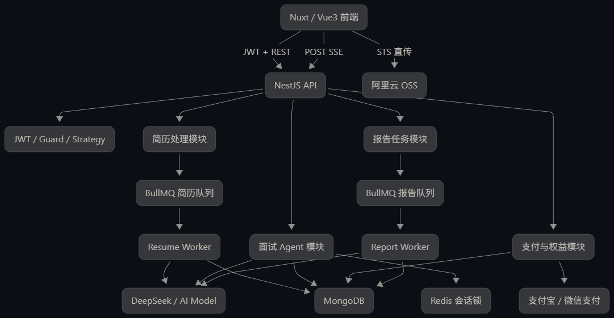

### 一次回合中数据如何变化

|阶段|MongoDB|内存 Session|前端|
|---|---|---|---|
|提交前|当前问题未回答|`idle`|`waiting`|
|接收回答|保存 answer、turnId|`evaluating`|显示候选人回答|
|Agent 评估|保存 Session 检查点|`evaluating`|正在分析回答|
|Agent 决策|更新 agentState|`generating`|显示维度/难度|
|生成问题|创建问题占位|保存流式累积结果|流式显示问题|
|生成完成|写入问题和参考答案|`idle`|`waiting`|
|回合完成|保存 lastCompletedTurnId|清除 processingTurnId|清除 pendingTurn|
|失败|回答仍保留|`retryable`|允许重试|
系统先*评估*
```
{
  "dimension": "SSE",
  "score": 58,
  "strengths": [
    "能够说明 SSE 用于实时推送"
  ],
  "gaps": [
    "没有解释事件协议",
    "没有说明断线恢复",
    "没有说明代理服务器缓冲问题"
  ],
  "needsFollowUp": true
}
```

然后再根据评估结果和面试状态*决策*
```
{
  "action": "follow_up",
  "dimension": "SSE",
  "difficulty": "medium",
  "reasonCode": "insufficient_depth"
}
```

*服务端策略校验逐条拆解*
模型决策通过 Zod 后，进入：

```
enforceAgentPolicy(
  state,
  decision,
  elapsedMinutes,
  targetDuration,
);
```
规则一：达到总时长，强制结束
规则二：达到题数上限，强制结束
规则三：接近时间上限，不再追问
规则四：追问次数越界
规则五：模型选择未知维度

### 最终决策如何控制下一题 Prompt

Agent 不直接生成题目，只生成一个受控指令：

```
{
  "action": "follow_up",
  "dimension": "SSE",
  "difficulty": "medium",
  "reasonCode": "insufficient_depth",
  "instruction": "针对候选人刚才回答中的缺口继续追问，只提出一个问题。"
}
```

如果是切换维度：

```
{
  "action": "new_dimension",
  "dimension": "MongoDB",
  "difficulty": "hard",
  "reasonCode": "coverage_gap",
  "instruction": "切换到尚未覆盖的能力维度，只提出一个问题。"
}
```

这个 JSON 被序列化成 `agentDirective`，传给问题生成 Prompt。

### 为什么选择 SSE

常见实时通信方案：

| 方案        | 通信方向      | 适合场景         |
| --------- | --------- | ------------ |
| 普通 HTTP   | 请求一次、响应一次 | 快速 CRUD      |
| 轮询        | 前端定时查询    | 报告状态、支付状态    |
| SSE       | 服务端持续推送   | AI 文本生成、任务进度 |
| WebSocket | 双向长连接     | 实时游戏、语音、协同编辑 |

模拟面试的文字生成具有这些特点：

```
前端提交一次回答
服务端持续返回多个事件
同一时刻主要是服务端向前端推送
基于 HTTP 即可
```

因此 SSE 比 WebSocket 更轻量。

但报告生成使用轮询更合适，因为报告是一个持久化后台任务：

```
前端刷新页面
→ GET 报告进度
→ 数据库告诉前端真实状态
```

所以项目里是两种方案并存：

```
当前面试回合：SSE
后台报告任务：BullMQ + 状态轮询
```

### 项目的事件协议

当前主要事件：

| 事件                 | 含义      | 前端状态    |
| ------------------ | ------- | ------- |
| `start`            | 开场白流式生成 | 显示面试官开场 |
| `agent_evaluating` | 正在评估回答  | 正在分析回答  |
| `agent_deciding`   | 正在选择策略  | 显示维度、难度 |
| `thinking`         | 准备生成问题  | AI 思考中  |
| `question`         | 下一题内容   | 流式更新消息  |
| `reference_answer` | 参考答案    | 更新对应答案  |
| `waiting`          | 下一题生成完成 | 允许用户输入  |
| `end`              | 面试结束    | 进入报告阶段  |
| `error`            | 当前流程失败  | 允许安全重试  |
|                    |         |         |
### 为什么采用累计内容

优点：

- 前端不容易丢字符；
- 某一段事件重复时不会重复拼接；
- 状态更新简单；
- 更容易处理语音播报增量。

缺点：

- 每个事件都重复发送之前内容；
- 长文本总传输量接近 O(n²)；
- 问题很长时带宽浪费。

首版可以接受，因为面试题通常不长。

### `waiting` 为什么是重要的终止事件

前端不是根据：

```
question.isStreaming === false
```

单独判断用户能否回答，而是等待：

```
{
  "type": "waiting"
}
```

收到后：

```
interviewStore.interviewEventType =
  'waiting';

interviewStore.completeTurn();
```

`completeTurn()` 清除：

```
this.pendingTurn = null;
```

这代表：

```
上一 turnId 已完成
用户下一次回答需要创建新 turnId
```

如果在问题还没保存完成前就清除 `pendingTurn`，网络失败后前端可能生成新的 `turnId`，导致重复推进。

### AbortController 的完整传递链

Controller 创建：

```
const abortController =
  new AbortController();
```

向下传递：

```
Controller
→ InterviewService
→ InterviewAgentService
→ InterviewAIService
→ LangChain model.invoke / chain.stream
```

模型调用：

```
model.invoke(
  prompt,
  signal ? { signal } : undefined,
);
```

流式调用：

```
chain.stream(
  params,
  signal ? { signal } : undefined,
);
```

业务循环中还主动检查：

```
if (signal?.aborted) {
  throw new Error(
    'INTERVIEW_STREAM_ABORTED'
  );
}
```

为什么两层都检查？

- 模型 SDK 支持 AbortSignal 时，底层网络请求直接停止；
- SDK 没有及时响应时，业务循环仍可以主动退出。

### `unsubscribe` 和 `abort` 的区别

断开连接时：

```
subscription.unsubscribe();
abortController.abort();
```

二者作用不同。

#### `unsubscribe()`

停止 Controller 接收 Subject 事件：

```
Service 继续运行
但 Controller 不再接收 next
```

它不一定会自动停止模型调用。

#### `abort()`

向模型调用传递取消信号：

```
停止 HTTP 请求
停止 token 流
触发异常恢复
```

因此只做 `unsubscribe()` 会出现：

```
浏览器已经离开
模型仍然继续消耗 Token
后端仍然继续执行
```

只做 `abort()` 也不够，因为 RxJS 订阅和 Response 资源仍要清理。

### 一次完整 SSE 时间线

```
00ms  前端提交 answer + turnId
10ms  JWT 校验通过
15ms  SSE connected
20ms  Redis 锁获取成功
35ms  回答保存 MongoDB
40ms  agent_evaluating
950ms Agent 评估完成
960ms agent_deciding
1420ms Agent 决策完成
1430ms thinking
1600ms question: "请"
1670ms question: "请说明"
1750ms question: "请说明 SSE"
2400ms question 完成
2450ms reference_answer 开始
3300ms reference_answer 完成
3350ms MongoDB 检查点保存
3360ms waiting
3370ms Subject complete
3380ms res.end
```

### Redis 锁不能代替权限校验

锁使用：

```
lock:interview:<sessionId>
```

它只能保证：

```
同一 Session 不被两个请求同时推进
```

不能保证：

```
当前用户拥有这个 Session
```

攻击者拿到其他用户的 `sessionId` 后，也可能尝试获取对应锁。

因此顺序应该理解为：

```
JWT 确认用户身份
→ Redis 锁控制并发
→ Session 归属校验
→ 执行业务
```

锁是并发机制，不是授权机制。
### STS 上传权限如何绑定用户

上传简历时，前端先获取 STS Token。

STS 接口需要 JWT：

```
JWT 确定 userId
→ 后端生成用户专属上传目录
→ STS 只允许写入该目录
```

例如：

```
users/user-001/resumes/<uuid>.pdf
```

用户不能自行指定：

```
users/user-002/resumes/victim.pdf
```

上传后，前端只提交：

```
{
  "objectKey": "users/user-001/resumes/a.pdf",
  "mimeType": "application/pdf",
  "fileSize": 123456
}
```

后端再次验证：

```
objectKey 是否属于当前 userId 目录
OSS Head 返回的真实大小
OSS Head 返回的真实类型
```

这属于：

```
授权前置约束
+ 上传后再次验证
```

STS Token 不是“给用户完整 OSS 权限”，而是短时间、最小范围的临时凭证。

### 完整支付流程

```
用户选择套餐
→ 后端创建本地订单
→ 后端调用支付平台
→ 前端展示二维码
→ 用户支付
→ 平台异步回调
→ 后端验签
→ 校验订单和金额
→ 原子抢占订单处理权
→ 发放权益
→ 写交易流水
→ 订单更新 success
→ 返回平台 success
```

支付状态查询也可能触发相同的本地成功处理：

```
前端轮询订单状态
→ 后端查询支付平台
→ 发现第三方已经成功
→ 调用统一成功处理方法
```

所以存在两个可能的成功入口：

```
支付平台回调
订单状态主动查询
```

两者必须进入同一个幂等方法，不能分别写两套权益发放逻辑。

### 为什么只看订单状态仍然不够

考虑这个执行顺序：

```
订单 pending → processing
→ 用户权益增加成功
→ API 进程突然崩溃
→ 订单还没来得及改成 success
```

数据库现在是：

```
用户已经获得权益
订单仍然 processing
```

服务重启后再次处理时，如果只看订单状态，可能再次发放权益。

因此需要第二层幂等：

```
processedOrders
```

|幂等层|作用|
|---|---|
|订单 `pending → processing`|防止多个请求同时进入处理逻辑|
|`processedOrders` 条件更新|防止崩溃恢复后重复发放权益|

只有第一层：

```
并发时安全
崩溃恢复后未必安全
```

只有第二层：

```
权益不会重复
但多个请求仍会重复执行其他逻辑
```

两层结合更完整。

### 支付回调不能依赖用户 JWT

支付回调由支付宝或微信服务器发送，不是用户浏览器发送。

因此没有：

```
Authorization: Bearer JWT
```

它的可信来源是：

```
平台签名验证
```

流程：

```
读取回调
→ 验证签名
→ 检查时间戳和证书
→ 获取订单号
→ 查询本地订单
→ 校验金额
→ 发放权益
```

不能因为回调参数中有：

```
{
  "userId": "user-001"
}
```

就直接相信该用户 ID。

用户归属应从本地订单读取：

```
outTradeNo
→ 查询本地 PaymentRecord
→ 得到可信 userId
```

### 支付状态查询为什么不能只是查本地数据库

前端轮询：

```
POST /payment/order/status
```

如果只查询本地订单：

```
支付平台已经成功
但回调丢失
本地一直 pending
```

用户会一直看到未支付。

因此可以：

```
查询本地状态
→ 如果 success，直接返回
→ 如果 pending，查询第三方平台
→ 如果第三方成功，进入统一 finalize
```

但轮询也需要：

- 限流；
- 查询间隔；
- 最大查询次数；
- 防止每次都调用第三方接口。

### 支付链路的数据变化

| 阶段   | 本地订单          | 用户权益 | 交易流水 |
| ---- | ------------- | ---- | ---- |
| 创建订单 | `pending`     | 不变   | 无    |
| 用户支付 | 可能仍 `pending` | 不变   | 无    |
| 抢占处理 | `processing`  | 不变   | 无    |
| 权益发放 | `processing`  | $inc | 可能还无 |
| 流水写入 | `processing`  | 已增加  | 已存在  |
| 完整成功 | `success`     | 已增加  | 已存在  |
| 重复回调 | `success`     | 不变   | 不重复  |

项目中涉及四类容易混淆的数据：

|数据模型|负责什么|
|---|---|
|`User`|当前余额和剩余次数|
|`ConsumptionRecord`|一次 AI 服务从开始到完成/失败的过程|
|`UserTransaction`|用户余额或权益的每一次变化|
|`PaymentRecord`|第三方支付订单状态|

### 面试时的完整回答模板

> 创建订单时，前端只提交套餐 ID，金额和权益由后端套餐配置决定，并保存到本地订单快照。用户支付后，支付回调和前端主动查询都可能发现成功，因此二者统一进入 `finalizePaymentSuccess`。
> 
> 处理时先验证平台签名、订单号、支付状态和实付金额，再通过条件原子更新把订单从 `pending` 抢占到 `processing`，保证并发回调中只有一个请求获得处理权。权益发放时使用 `processedOrders: {$ne: orderId}` 配合 $inc 和 $addToSet，把防重、权益增加和处理标记合并为一次用户文档原子更新。
> 
> 同时交易流水通过订单号去重，最后才把订单更新为 `success`。这样即使进程在权益发放后、订单成功前崩溃，重试也能通过 `processedOrders` 和流水判断已执行步骤，避免重复发放。
> 
> 我把这个方案理解为“至少一次通知加幂等消费”，而不是绝对 Exactly Once。生产化还需要对账任务，并把持续增长的 `processedOrders` 拆成带唯一索引的权益发放记录。
### 面试时的完整回答模板

> 我没有让大模型直接控制面试流程，而是把 Agent 拆成回答评估、策略决策和问题生成三个阶段。评估结果与决策结果都通过 Zod 做运行时校验，模型输出非法 JSON 时只进行一次格式修复。
> 
> Zod 通过后还不能直接执行，因为结构合法不代表业务合法。服务端会根据题数、时长、维度白名单、单维度追问次数和连续追问次数再次校验。如果模型决策越界，后端会将其降级为切换维度或结束。
> 
> 最终数据库只保存能力维度、评分、动作、难度和受控原因码，不保存模型思维链。问题生成模型也不能自行结束 V1 面试，是否结束只能由通过服务端规则校验后的 Agent 决策决定。
> 
> 这样模型负责智能判断，NestJS 负责权限、状态和业务边界，避免模型输出直接影响权益和数据库。
### 你现在应该能说出的三分钟版本

> 用户提交回答时，前端会为当前回合生成 `turnId` 并保存在 Pinia 中，网络失败重试时复用同一个 ID。请求经过 JWT Guard 后，Controller 建立 SSE 连接，并通过 RxJS Subject 把 Service 产生的阶段事件转成 SSE 数据。
> 
> Service 首先使用 Redis 锁串行化同一 `sessionId` 的回答请求，然后从内存或 MongoDB 恢复会话，并通过 `userId` 校验资源归属。后端会检查 `lastCompletedTurnId` 和 `processingTurnId`，分别处理重复请求和并发冲突。
> 
> 业务上先持久化候选人回答，再调用 Agent。Agent 分两步完成结构化回答评估和策略决策，输出经过 Zod 校验，并由服务端规则进一步限制题数、时长和追问次数。合法决策才会进入下一题生成。
> 
> 如果 SSE 断开，AbortController 会中止模型流，但已经保存的回答和 Agent 检查点会保留，回合标记为可重试。前端使用相同 `turnId` 恢复，不会重复保存回答或生成两道题。

### 你在面试中可以这样讲

> 我把一次面试回答建模成一个带 `turnId` 的业务回合。后端获得会话锁后，先校验资源归属和回合幂等，再把候选人回答写入 `qaList` 和 `sessionState`，之后才调用 Agent。
> 
> Agent 的评估、决策和下一题生成属于后续阶段，即使模型超时或 SSE 断开，用户回答也不会丢失。生成下一题时，我会先创建带 `turnId` 的问题占位项，生成成功后再更新问题和参考答案，最后保存 `lastCompletedTurnId` 检查点。
> 
> 因此同一回合重试时，系统能够判断回答是否已经保存、问题占位是否已经创建、回合是否已经完成，从而避免重复保存回答或生成两道题。面试结束后只更新为 `queued` 并投递 BullMQ，报告 Worker 独立完成后续状态流转。

### 面试时的回答模板

> 我们的模拟面试使用 POST SSE，因为回答请求需要携带 JWT、自定义请求体和 `turnId`，不适合直接使用原生 EventSource。Controller 设置 `text/event-stream` 响应头，并订阅 Service 返回的 RxJS Subject，将 Agent 评估、策略决策、问题生成、参考答案和等待状态编码为结构化事件。
> 
> 前端不是简单拼接字符串，而是用事件类型驱动状态机。`waiting` 表示当前回合已经完整持久化，收到它之后才清除前端保存的 `pendingTurn`。如果连接中断，前端保留原来的 `turnId` 和回答，后端通过 AbortController 中止模型流，并将 Agent 状态保存为 `retryable`。
> 
> SSE 本身不负责可靠恢复，因为已经发送的 token 不等于已经保存的业务结果。恢复时始终以 MongoDB 中的 `lastCompletedTurnId`、`agentState` 和 `qaList` 为准。报告生成生命周期更长，因此使用 BullMQ 和持久化状态轮询，而不是维持一条长 SSE。

### 面试时的回答模板

> JWT 在项目中只负责身份认证。请求经过 `JwtAuthGuard` 和 `JwtStrategy` 后，后端从验证后的 Payload 中取得 `req.user.userId`，而不是相信前端传入的用户 ID。
> 
> 资源授权在 Service 和数据库查询层完成。例如报告、面试会话、订单和简历都会使用 `{ resultId, userId }` 或等价条件查询。这样即使用户拿到其他人的 `resultId`，查询条件中的 `userId` 也不匹配，不会读取或修改其他用户的数据。
> 
> 对更新操作我同样要求携带用户范围，因为查询漏掉 `userId` 会造成数据泄露，更新漏掉则可能直接篡改其他用户状态。Redis 锁只解决并发，UUID 只降低枚举概率，CORS 只约束浏览器，它们都不能替代资源归属校验。
> 
> 对没有 JWT 的异步链路，例如支付回调和 BullMQ Worker，则分别依赖支付平台签名或 API 进程传递的可信任务上下文，但数据库操作仍携带 `userId` 和业务主键进行范围约束。

### 面试时的完整回答模板

> 我将用户当前余额、消费过程和账户流水拆成不同模型。User 只保存当前旺旺币和剩余面试次数，ConsumptionRecord 记录一次 AI 服务从 pending 到 success 或 failed 的生命周期，UserTransaction 记录每次购买、消费、退款和兑换造成的账户变化。
> 
> 权益扣减使用条件原子更新，把“剩余次数大于 0”和“次数减 1”放在同一个 `findOneAndUpdate` 中，避免两个并发请求同时消费最后一次权益。旺旺币兑换同样在一次 User 文档更新中完成余额校验、扣币和面试次数增加。
> 
> AI 最终失败时执行的是补偿事务，而不是回滚原事务。退款以 `recordId` 为幂等键，通过未退款条件抢占处理权，增加用户权益并写退款流水。严格情况下这三个操作放入 MongoDB Transaction，避免标记已退款但权益尚未加回的中间状态。
> 
> 对单回合模型超时，我不会直接退整场次数，而是保留回答和 Agent 检查点，让用户使用相同 `turnId` 恢复；报告失败则交给 BullMQ 重试。这样权益策略与实际服务交付阶段是一致的。
> 



用户业务主线：
```
登录
→ 上传简历
→ 简历结构化
→ 选择岗位和 JD
→ 扣减面试权益
→ 开始模拟面试
→ Agent 动态追问
→ SSE 实时反馈
→ 结束面试
→ 报告异步生成
→ 历史复盘
```
### 项目的真正核心不是 AI 调用

普通 AI 项目可能只有：

```
用户输入
→ 拼 Prompt
→ 调模型
→ 展示结果
```

你的项目现在已经包含：

```
输入可信化
状态持久化
模型输出约束
并发控制
失败恢复
权益消费
异步任务
资源授权
前端状态机
结果可追溯
```

所以不要把项目介绍成：

> 我调用 DeepSeek 实现了一个 AI 面试网站。

更好的定位：

> 我实现的是一个带付费权益和持久化报告的 AI 面试服务，并重点把模型调用改造成受约束、可恢复、可审计的 Agent 工作流。


### 3 分钟项目介绍

#### 第一部分：业务背景

> 项目面向 C 端求职用户，核心问题是用户上传简历和目标 JD 后，希望快速获得针对性面试题、模拟面试过程和能力分析报告。项目不仅要调用模型，还涉及简历隐私、长任务等待、付费权益、历史结果复现和用户数据隔离。

## 第二部分：简历处理

> 简历上传采用前端获取 STS 后直传 OSS，后端只接收 `objectKey`，不接受任意 URL。后端校验文件归属、类型和大小后，将解析任务投递到 BullMQ。Worker 提取 PDF 或 DOCX 文本，进行 PII 清理，再调用模型转换成标准简历对象，并使用 Zod 做运行时校验。  
> 面试开始时保存 `resumeProfileSnapshot` 和解析版本，使历史报告不受用户后续修改简历影响。

## 第三部分：Agent 面试

> 模拟面试不是让模型直接根据聊天历史随意生成下一题，而是拆成回答评估、策略决策和问题生成三个阶段。Agent 只能输出 `follow_up`、`new_dimension` 和 `finish`，模型结果经过 Zod 校验后，还要经过服务端题数、时长、维度和追问次数限制。  
> 因此模型负责智能判断，NestJS 负责业务边界。

## 第四部分：SSE 与恢复

> 前端通过 POST SSE 接收 `agent_evaluating`、`agent_deciding`、`question`、`waiting` 和 `end` 等事件，用 Pinia 驱动页面状态。每次开始请求和回答分别携带 `requestId` 与 `turnId`，后端再通过 Redis 会话锁串行化同一场面试。  
> 断线时 AbortController 会中止模型流，但回答和 Agent 检查点已经保存在 MongoDB，前端可以复用同一 `turnId` 恢复，不会重复扣权益或生成两道题。

## 第五部分：支付和报告

> 支付使用 `pending → processing → success` 状态机，通过订单状态抢占、用户 `processedOrders` 和交易流水实现幂等权益发放。消费时使用 MongoDB 条件原子更新扣减次数，AI 最终失败时通过消费记录执行幂等补偿。  
> 面试结束后 API 只负责更新结束状态并投递报告任务，独立 BullMQ Worker 生成报告，前端通过持久化状态轮询恢复。

## 第六部分：你的价值

> 这个项目中我不只是使用 AI 生成代码，而是形成了一套 AI 辅助开发流程：先让 AI 帮助梳理控制流和数据流，再设计状态机和约束，之后生成实现，由我检查资源归属、并发、失败补偿和测试场景，最后通过构建和自动化测试验证。


# 简历上传解析过程
## 一、先理解 STS 是什么

STS 全称是 Security Token Service。它不是文件存储服务，而是一个“临时授权服务”。

完整关系是：

```
前端浏览器
   │
   │ 1. 请求临时上传凭证
   ▼
NestJS 后端
   │
   │ 2. 使用服务端密钥向阿里云申请 STS Token
   ▼
阿里云 STS
   │
   │ 3. 返回临时 AccessKey、Secret、SecurityToken
   ▼
NestJS 返回给前端
   │
   │ 4. 前端使用临时凭证直传 OSS
   ▼
阿里云 OSS
```

后端不会把自己的永久 AccessKey 暴露给浏览器。前端拿到的只是短期、权限受限的上传凭证。

---

## 二、从用户选择文件开始

### 1. 用户选择本地简历

前端一般通过：

```
<input
  type="file"
  accept=".pdf,.docx"
  @change="handleFileChange"
/>
```

用户选择文件后，浏览器得到一个 `File` 对象：

```
{
  name: "张三-前端简历.pdf",
  type: "application/pdf",
  size: 1024000,
  lastModified: 1760000000000
}
```

此时文件仍然只存在于用户本地浏览器内存中，还没有上传。

前端首先进行基础校验：

```
const allowedTypes = [
  "application/pdf",
  "application/vnd.openxmlformats-officedocument.wordprocessingml.document",
];

if (!allowedTypes.includes(file.type)) {
  throw new Error("只支持 PDF 或 DOCX");
}

if (file.size > 5 * 1024 * 1024) {
  throw new Error("文件不能超过 5MB");
}
```

这里的校验主要是为了提升用户体验，但它不能作为最终安全校验。因为 MIME 类型、文件名、请求参数都可以被伪造，后端还必须重新校验。

---

## 三、前端请求 STS 临时凭证

前端调用：

```
POST /sts/getStsToken
Authorization: Bearer <JWT>
```

请求中通常不需要传文件内容，也不应该传任意外部 URL。

后端从 JWT 中解析当前用户：

```
const userId = req.user.userId;
```

然后生成当前用户专属的 OSS 目录：

```
const objectPrefix = `resumes/${userId}/`;
```

例如：

```
resumes/64f123abc/2026/08/31/uuid.pdf
```

这里的核心安全思想是：

```
用户 A 只能获得 resumes/userA/ 下的写入权限
用户 B 只能获得 resumes/userB/ 下的写入权限
```

后端不能让前端直接传入：

```
{
  "prefix": "../../admin/"
}
```

否则用户可能利用路径控制其他用户的文件。

---

## 四、后端向阿里云申请 STS

NestJS 的 STS Service 通常负责三件事：

1. 读取服务端环境变量；
2. 调用阿里云 RAM/STS API；
3. 构造只允许上传指定目录的临时策略。

服务端保存的是永久密钥：

```
ALIYUN_ACCESS_KEY_ID=xxx
ALIYUN_ACCESS_KEY_SECRET=xxx
ALIYUN_ROLE_ARN=acs:ram::xxx:role/resume-upload-role
ALIYUN_OSS_BUCKET=xxx
ALIYUN_OSS_REGION=xxx
```

这些信息不能发送给前端。

后端向 STS 请求后，得到类似结果：

```
{
  "AccessKeyId": "STS.xxxxx",
  "AccessKeySecret": "xxxxx",
  "SecurityToken": "xxxxx",
  "Expiration": "2026-08-31T12:00:00Z"
}
```

然后后端通常会再包装一层返回：

```
{
  "accessKeyId": "STS.xxxxx",
  "accessKeySecret": "xxxxx",
  "securityToken": "xxxxx",
  "bucket": "mianshiwang-resume",
  "region": "oss-cn-hangzhou",
  "expiration": "2026-08-31T12:00:00Z",
  "keyPrefix": "resumes/64f123abc/"
}
```

这里的 `keyPrefix` 不是随便给前端决定的，而是后端根据当前登录用户生成的。

---

## 五、为什么 STS 返回的权限不是永久权限

STS Token 的权限一般需要满足以下限制：

```
有效期有限，例如 15 分钟
只能操作指定 Bucket
只能写入当前用户目录
只能执行 PutObject
不能删除其他文件
不能列出整个 Bucket
不能读取其他用户文件
```

权限模型类似：

```
{
  "Effect": "Allow",
  "Action": [
    "oss:PutObject",
    "oss:HeadObject"
  ],
  "Resource": [
    "acs:oss:*:*:mianshiwang-resume/resumes/userId/*"
  ]
}
```

实际配置可能由阿里云策略完成，但面试时要讲清楚这个原则：

> STS 的价值不只是“临时密钥”，更重要的是把上传权限限制在时间、用户和对象路径三个维度内。

---

## 六、前端构造 OSS Object Key

拿到 STS 后，前端不能直接使用用户上传的文件名作为完整路径：

```
const objectKey = `${keyPrefix}${file.name}`;
```

这种方式存在几个问题：

- 文件名可能包含特殊字符；
- 同名文件会覆盖；
- 用户可以尝试构造路径；
- 文件名可能非常长；
- 文件名可能带有隐私信息。

更合理的方式是后端或前端生成唯一名称：

```
const extension = file.name.split(".").pop()?.toLowerCase();

const objectKey =
  `${keyPrefix}${crypto.randomUUID()}.${extension}`;
```

例如：

```
resumes/64f123abc/1f58f9e2-7f52-4c72-a4c5-9a7d1c.pdf
```

建议数据库额外保存原始展示名称：

```
{
  "resumeName": "张三-前端简历.pdf",
  "objectKey": "resumes/64f123abc/1f58f9e2-7f52-4c72-a4c5-9a7d1c.pdf"
}
```

前端展示 `resumeName`，系统内部使用 `objectKey`。

---

## 七、浏览器直传 OSS

前端使用阿里云 OSS SDK，或者使用签名 URL 直接上传：

```
const client = new OSS({
  region: token.region,
  bucket: token.bucket,
  accessKeyId: token.accessKeyId,
  accessKeySecret: token.accessKeySecret,
  stsToken: token.securityToken,
});

await client.put(objectKey, file);
```

这一阶段的网络路径是：

```
浏览器 ───────────────► 阿里云 OSS
```

而不是：

```
浏览器 ─► NestJS ─► OSS
```

这就是“前端直传”。

### 为什么要直传？

如果由后端中转：

```
浏览器上传 5MB
       ↓
NestJS 接收 5MB
       ↓
NestJS 再上传 5MB 到 OSS
```

后端会承担：

- 文件带宽；
- 请求连接；
- 内存或临时磁盘；
- 上传超时；
- 大文件并发压力。

直传之后：

```
浏览器 ─► OSS
NestJS 只负责授权和登记
```

后端压力明显降低。

---

## 八、OSS 上传成功后，发生了什么

OSS 返回上传成功结果，通常包含：

```
{
  "name": "resumes/64f123abc/uuid.pdf",
  "etag": "\"A1B2C3...\"",
  "url": "https://bucket.oss-cn-hangzhou.aliyuncs.com/..."
}
```

前端不应该把这个完整 URL 当作业务凭证提交给后端。

前端真正需要提交的是：

```
POST /resumes
Authorization: Bearer <JWT>
Content-Type: application/json
```

```
{
  "resumeName": "张三-前端简历.pdf",
  "objectKey": "resumes/64f123abc/uuid.pdf",
  "mimeType": "application/pdf",
  "fileSize": 1024000
}
```

这一步的含义是：

> 文件已经存在 OSS，现在通知业务后端：“这是我刚才上传的那份文件，请登记并开始处理。”

---

## 九、后端登记 Resume 记录

后端收到 `POST /resumes` 后，不会直接相信前端传来的信息，而是进行多层校验。

### 1. 校验当前用户身份

从 JWT 获取：

```
const userId = req.user.userId;
```

不能使用前端传来的：

```
{
  "userId": "other-user-id"
}
```

前端不应该拥有决定数据归属的权力。

---

### 2. 校验 Object Key 所属目录

后端检查：

```
objectKey.startsWith(`resumes/${userId}/`)
```

如果用户 A 提交：

```
resumes/userB/abc.pdf
```

直接拒绝。

这一步用于防止用户利用 OSS Token 或请求参数访问其他人的目录。

---

### 3. 调用 OSS HeadObject 校验真实文件

后端使用服务端 OSS Client 调用：

```
const metadata = await oss.head(objectKey);
```

得到 OSS 真实信息：

```
{
  "size": 1024000,
  "contentType": "application/pdf",
  "etag": "\"A1B2C3\""
}
```

然后比较前端声明值：

```
if (metadata.size !== dto.fileSize) {
  throw new BadRequestException("文件大小不一致");
}
```

还要检查：

```
真实对象存在
真实大小不超过 5MB
真实类型为 PDF 或 DOCX
文件不是空文件
对象确实位于当前用户目录
```

这一步非常重要，因为前端传来的 `mimeType` 和 `fileSize` 都不可信。

---

### 4. 创建数据库记录

数据库中的 Resume 记录可以是：

```
{
  "resumeId": "resume_abc123",
  "userId": "user_001",
  "resumeName": "张三-前端简历.pdf",
  "objectKey": "resumes/user_001/uuid.pdf",
  "mimeType": "application/pdf",
  "fileSize": 1024000,
  "status": "uploaded",
  "parserVersion": "v1",
  "retryCount": 0,
  "createdAt": "2026-08-31T10:00:00Z"
}
```

注意：

```
MongoDB 保存的是文件元数据和处理结果
OSS 保存的是原始文件
MongoDB 不保存完整原始简历文本
```

---

## 十、为什么后端不直接保存 resumeURL

旧式设计可能是：

```
{
  "resumeURL": "https://xxx.com/resume.pdf"
}
```

后端收到 URL 后再下载：

```
await axios.get(resumeURL);
```

这种设计有明显风险：

```
1. 用户可以传入任意外部 URL
2. 后端可能访问内网地址
3. 可能触发 SSRF
4. URL 可能过期
5. URL 可能指向恶意文件
6. 无法确认文件属于当前用户
7. 业务数据依赖外部链接是否长期有效
```

因此现在应该只接受：

```
{
  "objectKey": "resumes/user_001/uuid.pdf"
}
```

后端自己根据可信配置访问 OSS。

---

## 十一、上传登记后，投递解析任务

Resume 创建成功后，状态从：

```
uploaded
```

变成：

```
queued
```

然后投递任务：

```
await resumeQueue.add(
  "parse-resume",
  {
    resumeId,
    userId,
    objectKey,
    parserVersion: "v1",
  },
  {
    jobId: `${resumeId}:v1`,
  },
);
```

任务中不应该放完整简历文本，也不应该放下载 URL，只放必要定位信息：

```
interface ResumeParseJob {
  resumeId: string;
  userId: string;
  objectKey: string;
  parserVersion: "v1";
}
```

这样做的好处：

- Redis 中不暴露敏感简历内容；
- 任务体积很小；
- Worker 可以根据 `objectKey` 重新读取 OSS；
- 任务失败后可以安全重试；
- `resumeId:parserVersion` 可以作为幂等键。

---

## 十二、Worker 如何读取并解析文件

解析 Worker 的逻辑是：

```
取出任务
  ↓
查询 Resume
  ↓
校验 resumeId + userId
  ↓
状态改为 extracting
  ↓
从 OSS 下载 objectKey
  ↓
根据 MIME 类型选择解析器
  ↓
PDF 使用 PDF Parser
DOCX 使用 DOCX Parser
  ↓
得到纯文本
  ↓
清理 PII
  ↓
调用 DeepSeek 结构化
  ↓
Zod 校验
  ↓
保存 structuredData
  ↓
状态改为 ready
```

状态变化：

```
uploaded
   ↓
queued
   ↓
extracting
   ↓
structuring
   ↓
ready
```

失败时：

```
extracting / structuring
          ↓
        failed
```

---

## 十三、文件内容到底从哪里来

关键点是：后端不是从 URL 解析，而是通过 `objectKey` 从 OSS 读取对象。

Worker 可能执行类似逻辑：

```
const object = await oss.get(objectKey);
const buffer = object.content;
```

或者：

```
const stream = await oss.getStream(objectKey);
```

得到文件二进制内容后，再交给不同解析器：

```
if (mimeType === "application/pdf") {
  text = await extractPdfText(buffer);
}

if (
  mimeType ===
  "application/vnd.openxmlformats-officedocument.wordprocessingml.document"
) {
  text = await extractDocxText(buffer);
}
```

得到的文本只在当前任务执行期间存在：

```
const rawText = extractText(fileBuffer);
```

它不会长期写入 MongoDB。

---

## 十四、为什么要保留文本哈希

虽然不保存完整文本，但可以保存：

```
textHash = sha256(cleanedText);
```

例如：

```
sha256: 0c7f...a92d
```

文本哈希可以用于：

- 判断内容是否发生变化；
- 追踪历史报告使用的是哪一版简历；
- 排查结构化结果是否来自同一份文本；
- 防止重复解析；
- 日志追踪时避免暴露原文。

日志记录：

```
{
  "resumeId": "resume_abc123",
  "textLength": 4820,
  "textHash": "0c7f...a92d",
  "stage": "structuring",
  "durationMs": 4200
}
```

不记录：

```
简历 URL
手机号
邮箱
完整简历文本
模型 Prompt 原文
```

---

## 十五、解析完成后的数据结构

模型不会只返回一段自然语言，而是返回标准对象：

```
{
  "schemaVersion": "v1",
  "basicInfo": {
    "name": "张三",
    "currentTitle": "前端开发工程师",
    "yearsOfExperience": 1
  },
  "skills": [
    {
      "name": "Vue3",
      "category": "frontend",
      "proficiency": "熟悉",
      "evidence": "使用 Vue3 和 Nuxt 开发 AI 面试平台"
    },
    {
      "name": "NestJS",
      "category": "backend",
      "proficiency": "熟悉",
      "evidence": "实现用户鉴权、订单与 AI 服务"
    }
  ],
  "education": [],
  "workExperiences": [],
  "projects": [],
  "certificates": [],
  "otherSections": [],
  "warnings": []
}
```

然后使用 Zod 校验：

```
const result = ParsedResumeV1Schema.safeParse(modelOutput);

if (!result.success) {
  // 进入一次修复重试
}
```

第一次返回非法 JSON：

```
调用模型修复结构
```

第二次仍然失败：

```
status = failed
lastErrorCode = RESUME_STRUCTURING_INVALID
```

但数据库不保存完整原文。

---

## 十六、前端如何知道解析完成

前端在创建 Resume 后得到：

```
{
  "resumeId": "resume_abc123",
  "status": "queued"
}
```

之后轮询：

```
GET /resumes/resume_abc123
```

返回：

```
{
  "resumeId": "resume_abc123",
  "resumeName": "张三-前端简历.pdf",
  "status": "structuring",
  "parserVersion": "v1"
}
```

完成后：

```
{
  "resumeId": "resume_abc123",
  "status": "ready",
  "structuredData": {
    "schemaVersion": "v1",
    "skills": []
  }
}
```

前端只有在：

```
resume.status === "ready"
```

时，才允许进入押题或模拟面试。

如果状态是：

```
uploaded
queued
extracting
structuring
```

前端应该展示处理中，而不是直接发起 AI 面试。

---

## 十七、面试开始时如何复用简历

前端不再提交完整简历文本或 URL，而是：

```
{
  "resumeId": "resume_abc123",
  "company": "某互联网公司",
  "positionName": "前端开发工程师",
  "jd": "负责 Vue、React、工程化相关工作"
}
```

后端查询：

```
ResumeModel.findOne({
  resumeId,
  userId: currentUserId,
  status: "ready",
});
```

这个查询同时完成：

```
1. 简历是否存在
2. 简历是否属于当前用户
3. 简历是否解析完成
```

然后读取：

```
resume.structuredData
```

再放入 Prompt：

```
const params = {
  company,
  positionName,
  jd,
  resumeProfileJson: JSON.stringify(resume.structuredData),
};
```

这样押题和模拟面试使用的就是同一份结构化简历。

---

## 十八、为什么结果还要保存简历快照

假设用户后来修改或删除了简历，如果历史报告只保存：

```
{
  "resumeId": "resume_abc123"
}
```

那么以后重新查看报告时，可能找不到当时使用的简历版本。

所以在创建面试结果时保存：

```
{
  "resumeProfileSnapshot": {
    "schemaVersion": "v1",
    "skills": [],
    "projects": []
  },
  "resumeParserVersion": "v1",
  "resumeTextHash": "0c7f...a92d"
}
```

这形成：

```
原文件：OSS
当前简历：Resume
历史依据：InterviewResult.resumeProfileSnapshot
```

历史报告读取快照，不重新读取用户当前简历。

---

## 十九、面试时可以这样总结

你可以这样向面试官讲：

> 我们没有让后端接收任意简历 URL，也没有把永久 OSS 密钥暴露给前端。用户选择文件后，前端先通过 JWT 获取当前用户目录下的临时 STS 凭证，再直传 OSS。上传成功后，前端只提交 objectKey、文件名、MIME 和大小，后端会根据当前用户身份校验对象路径，并通过 HeadObject 校验 OSS 中文件的真实元数据。之后后端创建 Resume 记录并投递异步解析任务，Worker 从 OSS 读取文件，提取文本、清理 PII，再调用模型转换成标准化简历对象，经过 Zod 校验后持久化。押题和模拟面试统一使用这份结构化简历，面试结果还会保存快照，保证历史报告可以复现。

其中最值得强调的不是“用了 STS”，而是：

```
临时授权
+ 用户目录隔离
+ ObjectKey 校验
+ OSS 元数据复核
+ 异步解析
+ 标准化结构
+ 历史快照
+ PII 保护
```

这条链路体现的是完整的全栈工程设计，而不仅是简单的文件上传。

## 前端岗位的 3 分钟讲述版本

> 项目前端使用 Vue3、Nuxt 和 Pinia。困难点不是渲染聊天消息，而是 AI 面试回合是一个有状态、长耗时、可中断的流程。用户提交回答后，后端还会经历回答保存、Agent 评估、策略决策、问题流式生成和检查点保存等阶段。
> 
> 因此我设计了 POST SSE 事件协议，前端根据 `agent_evaluating`、`agent_deciding`、`question`、`waiting`、`end` 和 `error` 驱动状态，而不是根据文本猜测当前阶段。页面只展示后端白名单化的 Agent 信息，例如考察维度和难度，不展示模型自由推理。
> 
> 为了解决网络失败和重复发送，我给每次回答分配 `turnId`，并保存在 `pendingTurn` 中。第一次发送时添加用户消息；失败后恢复输入内容但保留同一个 `turnId`，重试不会在 UI 中重复添加消息，后端也能识别这是同一个业务回合。只有收到 `waiting`，前端才认为后端已完成当前回合持久化并清除 `pendingTurn`。
> 
> 报告生成是另一类问题，它生命周期更长、由独立 Worker 执行，所以前端不依赖原 SSE，而是根据持久化的 `reportStatus` 轮询恢复。这让我区分了实时交互和可靠任务恢复两类前端模式。