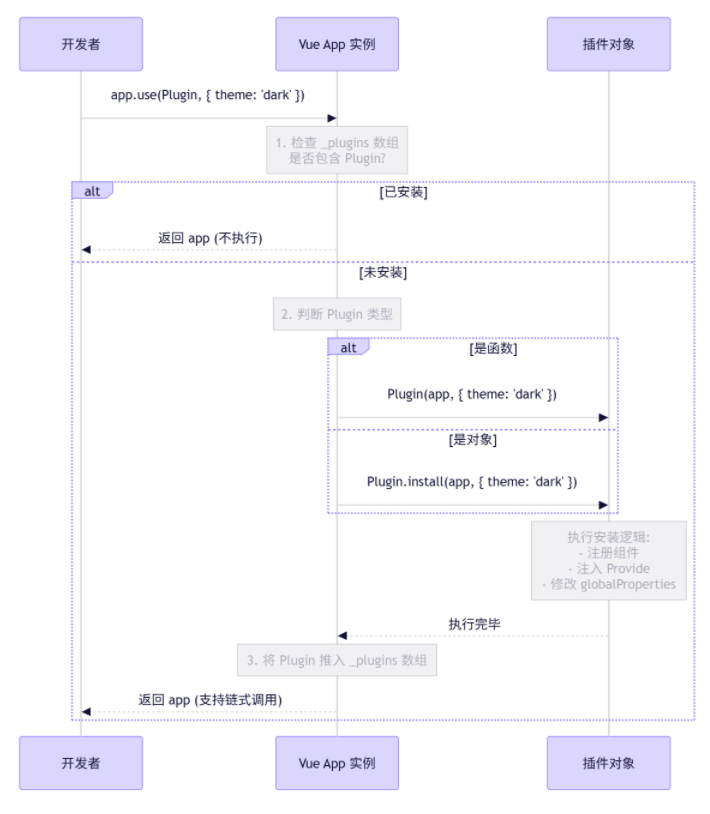

1. **实战篇**：如何编写一个符合最佳实践的 Vue 3 插件。
2. **原理篇**：深度解析 `app.use()` 的源码逻辑和运行机制。

### 一、如何编写一个高质量的 Vue 3 插件

在 Vue 3 中，插件本质上是一个**对象**或**函数**，它必须暴露一个名为 `install` 的方法（如果是函数，则函数本身即为 install 方法）。

#### 1. 标准插件结构（推荐对象形式）

```javascript
// my-plugin.js
const MyPlugin = {
  // install 是 Vue 调用的入口
  // app: 当前的 Vue 应用实例
  // options: 用户调用 app.use(MyPlugin, options) 时传入的参数
  install(app, options) {
    
    // 1. 注入全局配置 (可选)
    const config = options || { defaultMessage: 'Hello' };
    
    // 2. 添加全局属性 (Global Properties)
    // 在组件中可通过 this.$myProperty 或 getCurrentInstance().proxy.$myProperty 访问
    // 注意：Vue 3 推荐使用 provide/inject 替代 globalProperties 进行数据共享
    app.config.globalProperties.$myGlobalMsg = config.defaultMessage;

    // 3. 注册全局组件
    // import MyButton from './MyButton.vue';
    // app.component('MyButton', MyButton);

    // 4. 提供全局依赖 (Provide/Inject 模式 - 推荐)
    // 这比 globalProperties 更安全，且支持 TypeScript 推断
    app.provide('globalConfig', config);

    // 5. 添加全局指令
    app.directive('focus', {
      mounted(el) {
        el.focus();
      }
    });

    // 6. 添加全局混入 (mixin) - 慎用，可能影响性能
    // app.mixin({ ... });
    
    console.log('MyPlugin 已安装，配置为:', config);
  }
};

export default MyPlugin;
```

#### 2. 函数形式的插件

如果插件不需要配置，或者逻辑很简单，可以直接导出一个函数：

```javascript
// simple-plugin.js
export default function (app, options) {
  app.config.globalProperties.$version = '1.0.0';
}
// 使用时：app.use(simplePlugin)
```

#### 3. 在主程序中安装

```javascript
// main.js
import { createApp } from 'vue';
import App from './App.vue';
import MyPlugin from './my-plugin';

const app = createApp(App);

// 第二个参数 { defaultMessage: 'Hi Vue 3' } 会透传给插件的 install 方法
app.use(MyPlugin, { defaultMessage: 'Hi Vue 3' });

app.mount('#app');
```

### 二、`app.use()` 的底层运行机制

当你调用 `app.use(plugin)` 时，Vue 内部到底发生了什么？让我们通过模拟源码逻辑来揭示真相。

#### 1. 核心逻辑伪代码

Vue 3 的 `app.use` 逻辑大致如下（基于 Vue 源码简化）：

```javascript
// Vue 内部实现逻辑模拟
function createApp(rootComponent) {
  const app = {
    _component: rootComponent,
    _plugins: [], // 【关键点 1】用于存储已安装的插件，防止重复安装
    
    // 【关键点 2】use 方法的实现
    use(plugin, ...options) {
      // 检查是否已经安装过
      if (this._plugins.includes(plugin)) {
        console.warn('Plugin has already been applied to target app.');
        return this; // 直接返回，不再执行
      }

      // 处理插件格式
      // 情况 A: 插件是对象，必须有 install 方法
      if (isFunction(plugin)) {
        plugin(this, ...options);
      } 
      // 情况 B: 插件是对象，调用其 install 方法
      else if (isObject(plugin) && isFunction(plugin.install)) {
        // 【关键点 3】核心执行：将 app 实例和选项传给 install
        plugin.install(this, ...options);
      } 
      else {
        throw new Error(`Plugin must be a function or an object with an install method.`);
      }

      // 标记为已安装
      this._plugins.push(plugin);
      
      return this; // 支持链式调用
    },
    
    mount() {
      // ... 挂载逻辑
    }
  };
  
  return app;
}
```

#### 2. 机制深度解析

通过上面的伪代码，我们可以总结出 `app.use()` 的四个核心机制：

##### 🔹 机制一：防重入保护 (Idempotency)

- **现象**：无论你调用多少次 `app.use(MyPlugin)`，插件的 `install` 方法只会执行一次。
- **原理**：Vue 应用实例 (`app`) 内部维护了一个数组 `_plugins` (在源码中通常叫 `_plugins` 或类似名称)。每次调用 `use` 时，先检查该插件是否已在数组中。如果在，直接 `return`，跳过执行。
- **意义**：防止全局组件重复注册报错，防止全局变量被反复覆盖，确保副作用只发生一次。

##### 🔹 机制二：多态适配 (Polymorphism)

- **现象**：插件既可以是一个函数，也可以是一个包含 `install` 方法的对象。
- **原理**：`use` 方法内部做了类型判断：
    - 如果是**函数**：直接执行 `plugin(app, ...options)`。
    - 如果是**对象**：查找并执行 `plugin.install(app, ...options)`。
- **意义**：提供了灵活性。简单的插件写成函数更简洁；复杂的插件（需要暴露多个辅助方法或常量）写成对象更清晰。

##### 🔹 机制三：依赖注入上下文 (Context Injection)

- **现象**：插件内部可以随意操作 `app` 实例。
- **原理**：`app.use` 的核心动作就是把当前的 **应用实例 (`app`)** 作为第一个参数强塞给插件。
- **深层含义**：
    - 插件通过 `app` 参数获得了“上帝权限”。
    - 它可以调用 `app.component()` 注册组件。
    - 它可以调用 `app.directive()` 注册指令。
    - 它可以修改 `app.config.globalProperties`。
    - 它可以调用 `app.provide()` 注入数据。
    - **本质**：`app.use` 是一个**授权过程**，将应用实例的控制权暂时移交给插件代码执行。

##### 🔹 机制四：参数透传 (Argument Forwarding)

- **现象**：`app.use(Plugin, opt1, opt2)` 中的 `opt1, opt2` 能传到插件里。
- **原理**：利用 JavaScript 的剩余参数语法 (`...options`)。`use` 方法接收除 plugin 外的所有参数，并在调用 `install` 时原样展开传递。
    
```javascript
    // 源码逻辑
    plugin.install(this, ...options); 
    // 等价于 plugin.install(this, options[0], options[1], ...)
```

#### 3. 时序图



### 三、高级技巧与避坑指南

#### 1. 为什么推荐 `provide/inject` 而不是 `globalProperties`？

在 Vue 2 中，我们习惯用 `Vue.prototype.$xxx`。在 Vue 3 中，虽然保留了 `app.config.globalProperties`，但官方更推荐 `app.provide()`。

- **类型安全**：`provide/inject` 配合 TypeScript 可以完美推断类型，而 `globalProperties` 需要手动扩展接口。
- **性能**：`globalProperties` 会在每个组件实例上代理，大量属性可能轻微影响性能。
- **树摇优化**：`provide` 更符合组合式 API 的思维。

**最佳实践写法：**

```javascript
// 插件内
install(app) {
  const config = { api: '...' };
  app.provide('config', config); // 推荐
  // app.config.globalProperties.$config = config; // 旧方式
}

// 组件内
import { inject } from 'vue';
const config = inject('config'); 
```

#### 2. 插件的卸载 (Vue 3.3+)

在 Vue 3.3 之前，插件一旦安装无法卸载。Vue 3.3 引入了 `app.unmount()` 相关的清理机制，但目前原生 `app.use` 并没有对应的 `app.unuse()`。  
如果你需要插件可卸载，需要在 `install` 时返回一个卸载函数（虽然 Vue 核心目前不会自动调用它，但你可以手动管理）：

```javascript
const MyPlugin = {
  install(app) {
    const handler = () => {};
    window.addEventListener('resize', handler);

    // 返回一个卸载函数供高级用户使用
    return () => {
      window.removeEventListener('resize', handler);
      console.log('Plugin uninstalled');
    };
  }
};

// 手动调用 (非 Vue 原生自动行为，需自己设计架构支持)
// const uninstall = app.use(MyPlugin); 
// uninstall(); 
```

#### 3. 避免污染全局命名空间

不要在 `globalProperties` 上挂载太多东西。如果插件很大，尽量通过 Composables (`useXxx`) 的方式导出，让用户在组件中按需引入，而不是全部挂载到 `app` 上。

### 总结

- **怎么写**：导出一个带 `install(app, options)` 方法的对象，在方法里调用 `app.component`, `app.provide`, `app.directive` 等。
- **底层原理**：
    1. **查重**：通过内部数组防止重复安装。
    2. **适配**：兼容函数和对象两种形式。
    3. **注入**：将 `app` 实例作为第一个参数传入，赋予插件操作全局环境的能力。
    4. **透传**：将后续参数原样传递给 `install`。

理解了这一点，你就明白了 Vue 插件系统本质上是一个**“受控的全局环境修改器”**。