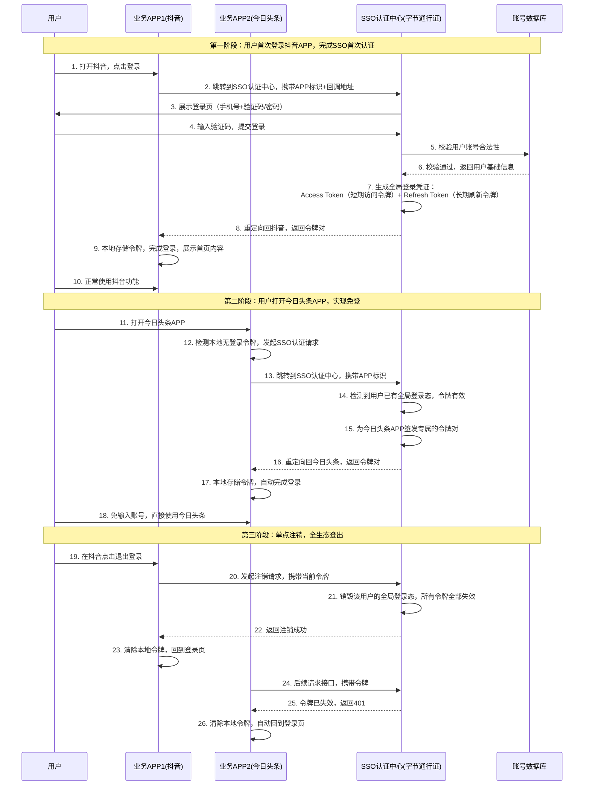
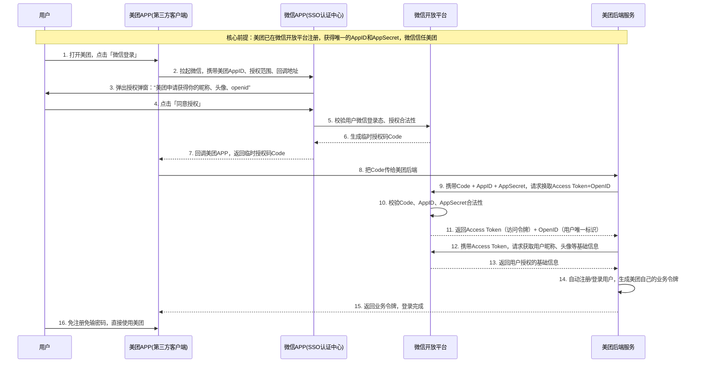

## 一、先给你最直观的认知：我们每天都在用 SSO

你一定有过这些体验，这些全都是 SSO 的落地应用：

1. 你在手机上登录了**抖音**，再打开今日头条、西瓜视频、番茄小说，发现自动就登录了，不用再输手机号验证码；
2. 你登录了**微信**，打开美团、拼多多、京东、王者荣耀，选择「微信登录」，一键就能登录，不用单独注册账号；
3. 你登录了**支付宝**，再打开淘宝、闲鱼、1688、饿了么，自动完成登录，全生态通行。

### 官方完整定义

SSO 全称 **Single Sign On（单点登录）**，是一套**分布式系统的统一身份认证方案**：在多个相互信任的独立应用 / 系统 / 终端中，用户只需要完成**一次账号密码 / 验证码的身份校验**，就能免登录访问所有信任系统，无需重复输入账号信息；同时支持一次注销，全系统登出。

## 二、SSO 不可缺少的 3 个核心角色

所有 SSO 流程都围绕这 3 个角色展开，我用市面 APP 案例给你具象化，再也不会混淆：

|核心角色|定义|抖音生态案例|微信登录美团案例|
|---|---|---|---|
|**用户（User）**|访问应用、需要身份认证的主体|抖音 APP 的使用者|美团 APP 的使用者|
|**业务系统 / 客户端（Client/Service）**|独立的、需要 SSO 认证的业务应用，本身不维护账号密码，只做令牌校验|抖音、今日头条、西瓜视频 APP|美团 APP|
|**SSO 认证中心（SSO Server）**|全体系唯一的账号管理、身份认证、令牌颁发 / 校验 / 注销中心，所有业务系统都无条件信任它|字节跳动统一账号认证中心（字节通行证）|微信账号体系 / 微信开放平台|

### SSO 核心铁则

**账号密码只会在 SSO 认证中心传输和校验，所有业务系统永远不会接触到用户的账号密码**，这是 SSO 安全的核心。

## 三、同企业 / 同生态多端 SSO

### 场景说明

这是最标准的 SSO 形态，典型案例：**字节跳动生态（抖音 + 今日头条 + 西瓜视频）、阿里生态（淘宝 + 支付宝 + 闲鱼）、腾讯生态（微信 + QQ + 腾讯视频）**。

核心特点：同一家公司的多个独立 APP / 网站，共用一套账号体系，一次登录，全生态自动登录。

### 完整流程图（以字节系 APP 为例）

### 分步详细拆解流程

#### 第一阶段：首次登录，建立全局 SSO 登录态

1. 用户打开抖音 APP，点击登录，抖音本身不处理登录逻辑，直接跳转到字节统一 SSO 认证中心，同时带上自己的 APP 唯一标识、登录成功后的回调地址；
2. SSO 认证中心展示统一的登录页面（手机号 + 验证码 / 密码），用户输入信息提交，**全程账号信息只在用户和 SSO 认证中心之间传输，抖音完全不接触**；
3. SSO 认证中心把账号信息传给账号数据库校验，确认是合法用户后，生成两套核心令牌：
    
    - `Access Token`：短期访问令牌（比如 2 小时有效期），用于业务接口请求的身份校验；
    - `Refresh Token`：长期刷新令牌（比如 30 天有效期），用于 Access Token 过期后，无感刷新获取新的令牌，不用用户重新登录；
    
4. SSO 认证中心把令牌对返回给抖音 APP，抖音在本地安全存储令牌，完成登录，用户可以正常使用。

#### 第二阶段：同生态其他 APP 免登（核心价值）

1. 用户打开今日头条 APP，APP 启动后检测本地没有登录令牌，直接跳转到字节 SSO 认证中心；
2. **最关键的一步**：SSO 认证中心检测到该用户已经在抖音完成了登录，全局登录态有效，无需用户再做任何操作；
3. SSO 认证中心直接为今日头条 APP 签发专属的令牌对，重定向回今日头条；
4. 今日头条存储令牌，自动完成登录，用户全程没有输入任何账号信息，实现了「一次登录，全生态通行」。

#### 第三阶段：单点注销，全生态登出

1. 用户在抖音点击退出登录，抖音向 SSO 认证中心发起注销请求；
2. SSO 认证中心收到请求后，直接销毁该用户的全局登录态，把该用户名下所有 APP 的令牌全部拉入黑名单失效；
3. 抖音清除本地令牌，回到登录页；
4. 后续今日头条再用自己的令牌请求接口时，SSO 认证中心会判定令牌已失效，返回 401 未授权，今日头条自动清除令牌，回到登录页，实现「一次注销，全系统登出」。

### 底层技术实现细节

1. **令牌方案**：市面主流 APP 几乎都用 **JWT（JSON Web Token）** 作为令牌格式，自带用户信息、过期时间、签名防篡改，无需服务端存储会话，天然支持分布式集群；
2. **APP 端全局登录态同步**：
    
    - 同公司 APP 之间，会通过系统级的共享存储、应用间跳转验签，同步 SSO 的登录态，实现更丝滑的免登；
    - 比如阿里系 APP，通过支付宝的登录态，同步给淘宝、闲鱼，无需每次都跳转到 SSO 认证中心；
    
3. **无感刷新**：Access Token 过期后，APP 会用 Refresh Token 自动向 SSO 认证中心申请新的令牌，用户完全无感知，不会被打断使用。

## 四、第三方授权 SSO（OAuth2.0/OIDC）

### 场景说明

这是我们日常接触最多的 SSO 形态，典型案例：**微信登录美团、QQ 登录王者荣耀、支付宝登录饿了么**。

核心特点：第三方业务系统不做账号体系，完全信任微信 / QQ / 支付宝的 SSO 认证中心，用户用微信账号一键登录第三方 APP，无需单独注册，也是「一次登录（微信），多处通行（所有支持微信登录的 APP）」。

> 补充：这个场景的底层协议是 **OAuth2.0（授权协议）**，在它之上扩展的 **OIDC（OpenID Connect）** 是专门用于身份认证的标准协议，也是目前第三方 SSO 的行业标准。

### 完整流程图（以微信登录美团 APP 为例）

### 分步详细拆解流程

1. 用户打开美团 APP，点击「微信登录」，美团不会让用户输手机号，而是直接拉起微信 APP，同时带上自己在微信开放平台注册的唯一 AppID、需要的授权范围（昵称、头像）、回调地址；
2. 微信 APP 收到请求后，先校验用户是否已经登录微信（如果没登录，会先让用户登录微信，完成 SSO 中心的身份认证），然后弹出授权弹窗，询问用户是否同意美团获取自己的基础信息；
3. 用户点击同意后，微信会生成一个**临时授权码 Code**（有效期极短，通常 5 分钟，只能用一次），通过回调地址返回给美团 APP；
4. 美团 APP 把 Code 传给自己的后端服务，美团后端携带 Code + 自己的 AppID + AppSecret（保密的密钥），向微信开放平台请求换取正式的 Access Token 和用户唯一标识 OpenID；
    
    > 关键：这一步必须在后端完成，绝对不能在前端 APP 里做，因为 AppSecret 是核心机密，泄露会导致严重安全问题；
    
5. 微信开放平台校验所有信息合法后，返回 Access Token 和 OpenID，美团后端再用 Access Token 去微信获取用户的昵称、头像等信息；
6. 美团后端用 OpenID 作为用户的唯一标识，自动完成注册（新用户）或登录（老用户），生成美团自己的业务令牌，返回给 APP，登录完成。

### 这个方案的核心优势

1. **用户体验拉满**：不用记多个账号密码，一键登录，1 秒完成；
2. **安全系数极高**：美团永远不会接触到用户的微信账号密码，所有身份校验都在微信 SSO 中心完成；
3. **降低获客成本**：用户不用注册，一键登录，大幅降低 APP 的注册流失率，这也是几乎所有 APP 都支持微信登录的核心原因。

## 五、SSO 核心安全保障机制

你看到的所有大厂 APP 的 SSO，都一定会做这些安全措施，避免账号被盗、令牌泄露：

1. **全程 HTTPS 加密**：所有 SSO 的请求、令牌传输，全程走 HTTPS，防止网络抓包窃听；
2. **令牌分级有效期**：Access Token 有效期极短（2 小时内），哪怕泄露，危害时间也很短；Refresh Token 有效期长，但只能用于刷新令牌，不能直接请求业务接口；
3. **签名防篡改**：所有请求都会携带签名，SSO 认证中心会校验签名，防止请求被篡改、伪造；
4. **授权范围最小化**：第三方 APP 只能获取用户必要的信息（昵称、头像），不能获取手机号、身份证等敏感信息，除非用户额外授权；
5. **风控拦截**：SSO 认证中心会做异地登录、异常设备、高频请求的风控校验，异常场景会要求用户二次验证（短信验证码、人脸识别）；
6. **令牌绑定机制**：令牌会和用户设备、APP 绑定，哪怕令牌泄露，在其他设备上也无法使用；
7. **黑名单机制**：用户注销、改密、账号被盗后，旧令牌会被立刻拉入黑名单，彻底失效。

## 六、常见误区澄清

1. **误区 1：SSO = OAuth2.0**
    
    错。SSO 是**单点登录的产品模式 / 解决方案**，而 OAuth2.0 是**实现 SSO 的一种技术协议**，除了 OAuth2.0，还有 CAS、SAML、OIDC 等协议都可以实现 SSO。
    
2. **误区 2：SSO 只能在 Web 端使用，APP 端用不了**
    
    错。现在市面 90% 的 APP 生态都在用 SSO，Web 端、APP 端、小程序、桌面端都可以完美支持，只是不同端的令牌存储、跳转逻辑略有差异。
    
3. **误区 3：SSO 只能在同公司的系统里用**
    
    错。第三方授权登录就是跨公司的 SSO，微信和美团是两家完全独立的公司，只要建立了信任关系，就能实现 SSO。
    
4. **误区 4：用了 SSO，业务系统就不用做权限控制了**
    
    错。SSO 只负责**身份认证（确认你是谁）**，而权限控制（你能做什么）还是需要各个业务系统自己实现，SSO 会把用户唯一标识传给业务系统，由业务系统自己管理菜单、按钮、数据权限。

## 七、面试回答模板（结合实际案例）

SSO 单点登录，是一套分布式系统的统一身份认证方案，核心是在多个相互信任的独立应用中，用户只需要完成一次身份校验，就能免登录访问所有信任系统，无需重复输入账号密码，同时支持一次注销全系统登出。

它的核心由三个角色组成：用户、业务应用、统一的 SSO 认证中心，其中 SSO 认证中心是唯一负责账号管理、身份认证、令牌颁发与注销的节点，所有业务应用都信任它，且全程不会接触到用户的账号密码。

市面上最常见的两种落地形态，一种是同生态多端 SSO，比如字节跳动的抖音、今日头条、西瓜视频，用户登录抖音后，同生态的其他 APP 自动完成登录；另一种是基于 OAuth2.0/OIDC 协议的第三方授权 SSO，比如我们常用的微信登录美团、拼多多，用户只需要登录微信，就能一键登录所有支持微信授权的第三方应用，不用单独注册账号。

它主要解决了多系统重复登录、账号管理分散、用户记忆成本高、密码泄露风险大等问题，是目前中大型企业多系统架构、互联网 APP 生态的标准身份认证方案。