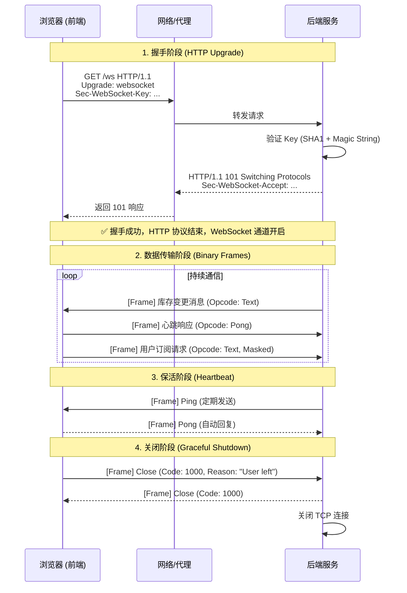

WebSocket 的网络请求过程非常独特，它 **“始于 HTTP，终于 TCP”**。简单来说，它先伪装成一次普通的 HTTP 请求进行“握手”，握手成功后，这条连接就“叛变”了，不再遵循 HTTP 协议，转而变成一条长期的、双向的 TCP 通道。

以下是完整的 **WebSocket 网络请求全过程**拆解：

### 第一阶段：握手（Handshake）—— “伪装成 HTTP 的升级请求”

这是 WebSocket 建立连接最关键的一步。客户端（浏览器）会发起一个标准的 **HTTP GET 请求**，但携带了一些特殊的 Header，告诉服务器：“我想升级协议，别把我当普通 HTTP 请求处理”。

#### 1. 客户端发送请求 (Client Request)

浏览器发出如下请求（注意那些特殊的 Header）：

```http
GET /ws/chat HTTP/1.1
Host: example.com
Upgrade: websocket                // 【关键】声明我要升级协议为 websocket
Connection: Upgrade               // 【关键】确认连接要升级
Sec-WebSocket-Key: dGhlIHNhbXBsZSBub25jZQ==  // 【关键】随机生成的 Base64 字符串，用于防缓存和验证
Sec-WebSocket-Version: 13         // 【关键】指定协议版本，必须是 13 (RFC 6455)
Origin: http://example.com        // 来源地址，用于服务端做跨域校验
Sec-WebSocket-Protocol: chat      // (可选) 子协议，比如指定是聊天还是游戏
```

- **Sec-WebSocket-Key 是什么？**
    - 它是一个随机生成的 16 字节字符串，经过 Base64 编码。
    - 它的作用不是加密，而是为了**防止浏览器缓存**以及让服务器证明“我真的懂 WebSocket 协议”。

#### 2. 服务端响应 (Server Response)

服务器收到请求后，解析 Header。如果同意升级，它会返回一个状态码为 **101** 的响应（101 Switching Protocols）。

```http
HTTP/1.1 101 Switching Protocols  // 【关键】状态码 101，表示协议切换成功
Upgrade: websocket                // 确认升级为 websocket
Connection: Upgrade               // 确认连接升级
Sec-WebSocket-Accept: s3pPLMBiTxaQ9kYGzzhZRbK+xOo=  // 【关键】对 Key 的处理结果
```

- **Sec-WebSocket-Accept 是怎么算出来的？（核心算法）**  
    服务器不能随便返回一个字符串，必须按 RFC 6455 标准计算，以此证明它真的支持 WebSocket：
    
    1. 拿到客户端传来的 `Sec-WebSocket-Key` (例如 `dGhlIHNhbXBsZSBub25jZQ==`)。
    2. 拼接一个固定的魔法字符串：`258EAFA5-E914-47DA-95CA-C5AB0DC85B11`。
    3. 对拼接后的字符串做 **SHA-1 哈希**。
    4. 将哈希结果做 **Base64 编码**。
    5. 返回这个值。
    
    > 如果客户端收到的 Accept 值和自己算的不一样，连接会立即关闭（安全机制）。
    

#### 3. 握手完成，HTTP 退场

一旦客户端收到 `101` 响应并验证 `Accept` 无误：

- **HTTP 协议使命结束**：后续的通信不再使用 HTTP 的“请求 - 响应”格式。
- **TCP 连接保留**：底层的 TCP 连接不断开，直接复用。
- **通道开启**：双方进入 **全双工（Full-Duplex）** 模式，随时可以互相发数据。

### 第二阶段：数据传输（Data Transfer）—— “二进制帧的世界”

握手成功后，通信双方通过 **WebSocket Frame（帧）** 来交换数据。这与 HTTP 的明文文本完全不同。

#### 1. 帧结构 (Frame Structure)

每个数据包都被拆分成一个个“帧”，结构如下（简化版）：

| 比特                  | 含义   | 说明                                                                                                                      |
| ------------------- | ---- | ----------------------------------------------------------------------------------------------------------------------- |
| **FIN (1 bit)**     | 结束标志 | 1 表示这是最后一帧，0 表示后面还有分片。                                                                                                  |
| **Opcode (4 bits)** | 操作码  | 定义数据类型：  <br>`0x1`: 文本 (Text)  <br>`0x2`: 二进制 (Binary)  <br>`0x8`: 关闭连接 (Close)  <br>`0x9`: 心跳 Ping  <br>`0xA`: 心跳 Pong |
| **MASK (1 bit)**    | 掩码标志 | **客户端发给服务器必须为 1** (进行异或加密)，服务器发给客户端通常为 0。                                                                               |
| **Payload Len**     | 数据长度 | 表示后面数据的长度。                                                                                                              |
| **Masking Key**     | 掩码密钥 | 如果 MASK=1，这里有 4 字节密钥，用于解码数据。                                                                                            |
| **Payload Data**    | 实际数据 | 真正的聊天内容、库存变更消息等。                                                                                                        |

如果我要传一张 10MB 的图片，或者一个巨大的 JSON，能一次性发完吗？  
TCP 是流式协议，没有边界。WebSocket 引入了 **分片（Fragmentation）** 机制。

_场景：发送 "Hello World"，但故意拆成两半发_

1. **第一帧**：
    - FIN = `0` (表示：还没完，接着听)
    - Opcode = `1` (文本)
    - Payload = `"Hello "`
2. **第二帧**：
    - FIN = `1` (表示：这是最后一块了)
    - Opcode = `0` (延续帧，Continuation，表示属于上一帧的一部分)
    - Payload = `"World"`

**接收方逻辑**：

- 收到第一帧 -> 缓存起来，等待下一帧。
- 收到第二帧 -> 拼接到缓存后 -> 发现 FIN=1 -> **组装完成** -> 触发 `onmessage` 事件，把 `"Hello World"` 交给你的 JavaScript 代码。

#### 2. 为什么客户端要“掩码”（Masking）？

你会发现客户端发出的数据都经过了一层简单的异或（XOR）加密。

- **原因**：这是为了防止**缓存污染攻击**。早期的某些代理服务器会缓存 HTTP 请求，如果客户端直接发纯文本，恶意用户可能构造特殊数据欺骗代理服务器。加上随机掩码后，每次请求的二进制流都不一样，代理服务器就无法缓存了。
- **注意**：服务器发给客户端的数据**不需要**掩码。

#### 3. 通信示例（库存变更场景）

- **服务器主动推送**：  
    服务器构造一个 Opcode 为 `0x1` (文本) 的帧，数据内容为 `{"type": "STOCK_UPDATE", "skuId": "1001", "stock": 0}`，直接通过 TCP 通道推给客户端。
- **客户端接收**：  
    客户端监听 `onmessage` 事件，解析帧，拿到 JSON 数据，触发前端重算逻辑。

### 第三阶段：心跳与保活（Heartbeat）—— “防止连接假死”

TCP 连接如果长时间没有数据传输，中间的防火墙、路由器或负载均衡器可能会认为连接已死，从而悄悄切断（Silent Drop）。

#### 1. Ping/Pong 机制

- **Ping**: 一方发送一个 opcode 为 `0x9` 的帧（通常不带数据或带少量数据）。
- **Pong**: 收到 Ping 的一方，必须尽快回复一个 opcode 为 `0xA` 的帧。
- **作用**：
    1. **保活**：告诉中间网络设备“我还活着，别断我连接”。
    2. **检测延迟**：计算 Ping-Pong 往返时间，判断网络质量。

> **最佳实践**：通常由**服务器**每隔 30-60 秒主动向客户端发送 Ping，客户端自动回复 Pong（浏览器会自动处理 Pong，无需 JS 干预）。如果服务器发了 Ping 却收不到 Pong，则判定客户端已掉线，清理资源。

### 第四阶段：关闭连接（Closing Handshake）—— “优雅的分手”

任何一方都可以发起关闭，但必须遵循“四次挥手”类似的优雅关闭流程，确保数据不丢失。

#### 1. 关闭流程

1. **发起方**：发送一个 Opcode 为 `0x8` (Close) 的帧，里面可以包含一个状态码（如 `1000` 表示正常关闭，`1001` 表示端点消失）和简短原因。
2. **接收方**：收到 Close 帧后，**停止发送新数据**，但要把之前没发完的数据发完。
3. **接收方回复**：发送一个同样的 Close 帧给发起方（确认收到）。
4. **断开 TCP**：发起方收到确认后，底层关闭 TCP 连接。

#### 2. 常见状态码

- `1000`: 正常关闭 (Normal Closure)。
- `1001`: 端点离开 (Going Away)，如页面刷新、导航走人。
- `1006`: 异常关闭 (Abnormal Closure)，通常指网络断了，没来得及发 Close 帧（前端 `onclose` 事件中经常看到这个）。
- `1008`: 策略违规 (Policy Violation)，如消息太大。
- `1011`: 服务器内部错误 (Internal Error)。

### 总结：完整流程图



### 对前端开发的意义

1. **兼容性**：因为握手是 HTTP，所以它能完美穿过大多数防火墙和代理（只要代理支持 HTTP Upgrade）。
2. **安全性**：
    - 必须校验 `Origin` 头，防止跨站 WebSocket 攻击（CSWSH）。
    - 生产环境务必使用 `wss://` (WebSocket over TLS)，就像 HTTPS 一样，加密整个握手和数据传输过程。
3. **断线重连**：由于网络波动（状态码 1006），前端代码**必须**实现自动重连机制（Exponential Backoff 指数退避算法），在连接断开后尝试重新发起握手。

这就是 WebSocket 从“假装 HTTP”到“真 TCP 长连接”的完整生命周期。