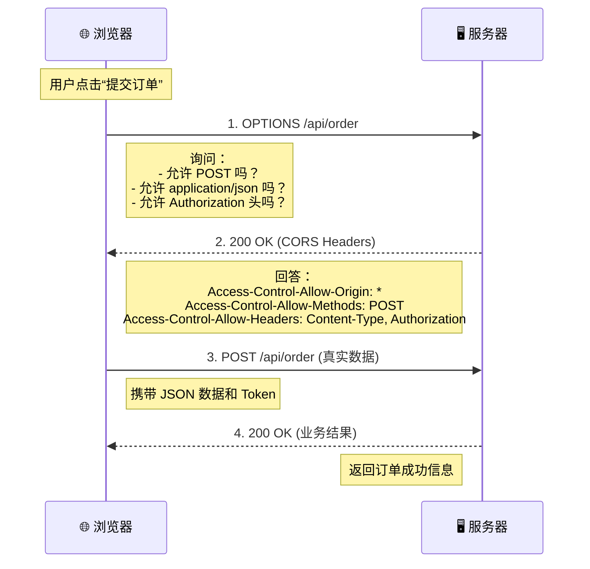

这个自动发出的 `OPTIONS` 请求被称为 **预检请求 (Preflight Request)**。

它是浏览器在发送正式请求（如 `POST`, `PUT`, `DELETE` 等）**之前**，自发进行的一次“安全问询”。

### 核心原因：CORS（跨域资源共享）安全机制

当你的前端页面（例如 `http://localhost:3000`）想要请求一个不同域的接口（例如 `https://api.example.com`），且该请求**不属于“简单请求”**时，浏览器为了防止恶意网站伪造请求（CSRF）或窃取数据，会先派一个“侦察兵”（OPTIONS 请求）去问服务器：

> “嘿，服务器！我是来自 `http://localhost:3000` 的页面。我想用 `POST` 方法发个带 `Content-Type: application/json` 的请求，还带了个 `Authorization` 头。**你允许我这么做吗？**”

只有服务器回答“允许”，浏览器才会真正发送那个包含数据的正式请求。如果服务器说“不行”，浏览器就会直接拦截，抛出 CORS 错误，**根本不会发送正式请求**。

### 什么时候会触发 OPTIONS 预检？

浏览器判断是否需要发 OPTIONS 的标准非常严格。只要满足以下 **任意一个** 条件，就会触发预检：

#### 1. 请求方法不是“简单方法”

- **简单方法**：`GET`, `HEAD`, `POST` (仅限特定情况)
- **非简单方法**：`PUT`, `DELETE`, `PATCH`, `OPTIONS` 本身
    - _例子_：你调用 `axios.put()` 或 `axios.delete()`，必发 OPTIONS。

#### 2. `Content-Type` 不是“简单类型”

即使是 `POST` 请求，如果 Header 中的 `Content-Type` 不是以下三种之一，也会触发预检：

- `application/x-www-form-urlencoded`
- `multipart/form-data`
- `text/plain`
- **常见触发点**：`application/json` (现代前端最常用的格式！)
- `application/xml`
    - _例子_：你发 JSON 数据 `axios.post(url, data, { headers: {'Content-Type': 'application/json'} })`，必发 OPTIONS。

#### 3. 请求头包含了“非简单字段”

除了浏览器自动添加的字段（如 `Accept`, `Accept-Language`, `Content-Language` 等）和上述简单的 Content-Type 外，如果你自定义了 Header，也会触发：

- `Authorization` (最常用！带 Token 时必发)
- `X-Custom-Header`
- `X-Requested-With` (有些旧项目用这个)
    - _例子_：你在 Header 里加了 `Authorization: Bearer <token>`，必发 OPTIONS。

#### 4. 其他复杂情况

- 使用了 `ReadabilityStream`。
- 上传了监听进度的事件 (`upload.onprogress`)。

### 完整流程图解

假设你要提交一个 JSON 格式的订单（`POST` + `application/json` + `Authorization`）：


### 后端如何处理？

后端必须正确响应这个 `OPTIONS` 请求，否则前端会报 `CORS Error`。

**后端需要返回的关键 Header：**

1. `Access-Control-Allow-Origin`: 允许哪个域名访问（如 `*` 或 `https://your-frontend.com`）。
2. `Access-Control-Allow-Methods`: 允许哪些方法（如 `POST, GET, OPTIONS`）。
3. `Access-Control-Allow-Headers`: **最重要！** 必须包含前端想用的所有自定义头（如 `Content-Type, Authorization`）。
4. `Access-Control-Max-Age`: (可选) 预检结果缓存多久（秒）。设置后可以减少 OPTIONS 请求频率。

**不同框架的处理示例：**

- **Node.js (Express + cors 中间件)**:
    
```javascript
    const cors = require('cors');
    app.use(cors({
      origin: 'http://localhost:3000',
      methods: ['GET', 'POST', 'PUT', 'DELETE', 'OPTIONS'],
      allowedHeaders: ['Content-Type', 'Authorization']
    }));
    // cors 中间件会自动处理 OPTIONS 请求并返回 204
```
	
- **Java (Spring Boot)**:
    
```java
    @CrossOrigin(origins = "http://localhost:3000", maxAge = 3600)
    @RestController
    public class OrderController { ... }
    // 或者配置全局 WebMvcConfigurer
```
    
- **Nginx**:
    
```nginx
    location /api/ {
        if ($request_method = 'OPTIONS') {
            add_header 'Access-Control-Allow-Origin' '*';
            add_header 'Access-Control-Allow-Methods' 'GET, POST, OPTIONS';
            add_header 'Access-Control-Allow-Headers' 'Content-Type, Authorization';
            add_header 'Access-Control-Max-Age' 1728000;
            add_header 'Content-Type' 'text/plain charset=UTF-8';
            add_header 'Content-Length' 0;
            return 204;
        }
        # 正常代理逻辑...
    }
```
    

### 常见问题与优化

#### Q1: 能取消这个 OPTIONS 请求吗？

**不能。** 这是浏览器的安全铁律，无法通过前端代码禁用。只要是非简单请求，它一定会发。

#### Q2: OPTIONS 请求太频繁影响性能怎么办？

可以通过设置 `Access-Control-Max-Age` 来缓存预检结果。

- 如果不设置：每次发正式请求前都要发一次 OPTIONS。
- 如果设置（如 `Max-Age: 86400`）：浏览器在 24 小时内，对同一个 URL 的相同请求方法/头，**不再发送 OPTIONS**，直接发正式请求。
    - _注意_：某些浏览器实现可能有差异，但通常有效。

#### Q3: 为什么开发环境没事，生产环境报错？

通常是因为生产环境的 Nginx 或网关（如 K8s Ingress）没有正确配置 CORS 头，或者后端代码只在开发环境开启了 CORS 中间件。检查生产服务器的响应头是否包含 `Access-Control-Allow-*`。

#### Q4: 怎么把 POST 变成“简单请求”从而避免 OPTIONS？

很难，因为现代 API 几乎都用 `application/json` 和 `Authorization`。

- 如果你能把 `Content-Type` 改为 `application/x-www-form-urlencoded` 且不带自定义 Header，可以避免。但这通常意味着要改变前后端的数据交互格式，得不偿失。**接受 OPTIONS 的存在是标准做法。**

### 总结

看到 `OPTIONS` 不要慌，它是浏览器的**保安**。

- **出现原因**：你的请求太“复杂”（用了 JSON、Token 或非 GET/POST 方法）。
- **解决方法**：确保后端正确配置了 CORS，返回了允许的 Headers。
- **优化手段**：配置 `Access-Control-Max-Age` 减少频次。