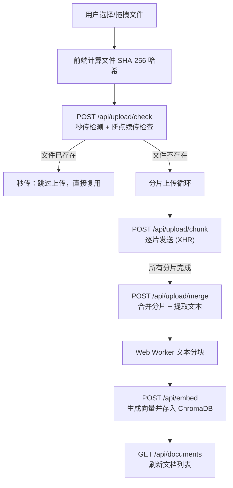
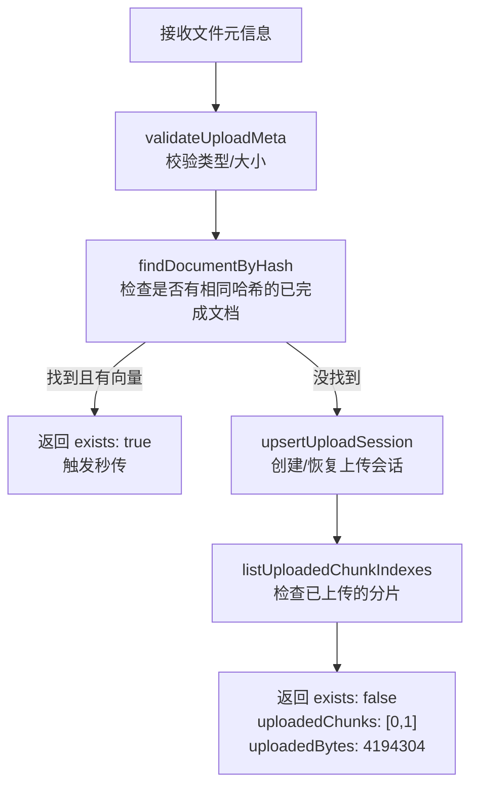
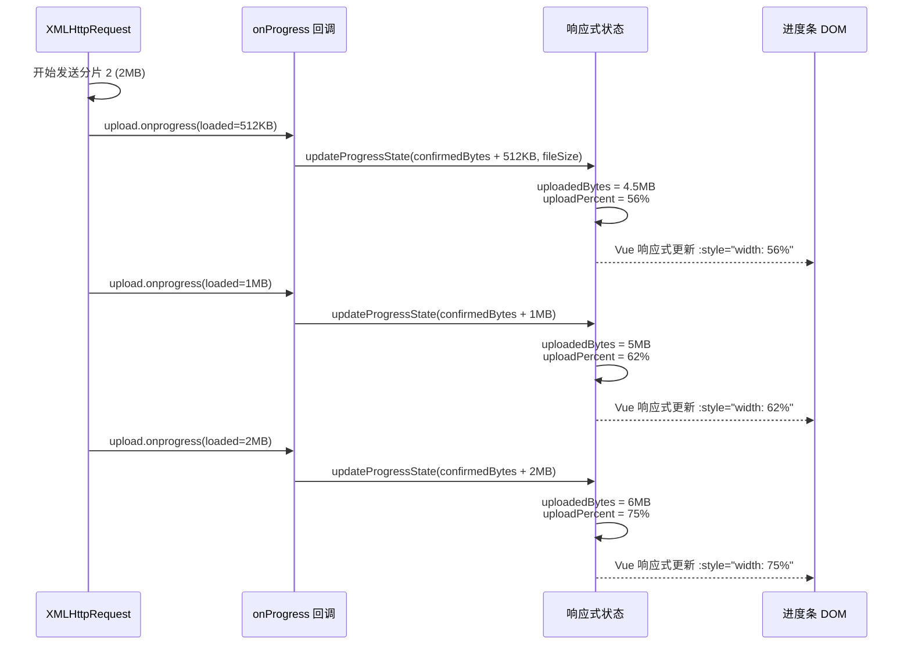

## 一、整体架构概览



整个上传流程分 **6 个阶段**：秒传检测 → 分片上传 → 合并文件 → 文本分块 → 向量化 → 刷新列表。

## 二、前端代码架构

项目采用 **组合式 API（Composable）** 模式，将文档管理逻辑封装在 [useDocuments.js](file:///d:/BaiduNetdiskDownload/Vue_Project/rag/app/composables/useDocuments.js) 中。

### 核心文件分工

| 文件 | 职责 |
|------|------|
| [useDocuments.js](file:///d:/BaiduNetdiskDownload/Vue_Project/rag/app/composables/useDocuments.js) | 上传状态管理、分片逻辑、进度计算 |
| [DocumentUpload.vue](file:///d:/BaiduNetdiskDownload/Vue_Project/rag/app/components/DocumentUpload.vue) | UI 渲染：上传区域、进度条、文档列表 |
| [index.vue](file:///d:/BaiduNetdiskDownload/Vue_Project/rag/app/pages/index.vue) | 页面入口，初始化 `docState = useDocumentsAdvanced()` |

### 状态变量详解

```javascript
// useDocumentsAdvanced() 内部的响应式状态
const documents = ref([])        // 已上传的文档列表
const isUploading = ref(false)   // 是否正在上传（控制 UI 切换）
const uploadProgress = ref('')   // 当前阶段的文字描述，如 "正在上传分片 3/5..."
const uploadPercent = ref(0)     // 进度百分比 0~100
const uploadedBytes = ref(0)     // 已上传的字节数
const totalBytes = ref(0)        // 文件总字节数
const error = ref(null)          // 错误信息
const notice = ref('')           // 通知信息（如秒传提示）
```

这些状态通过 `docState` 对象传递给 `DocumentUpload.vue` 组件。

## 三、完整上传流程逐步拆解

### 阶段 1：用户触发上传

[DocumentUpload.vue L16-L55](file:///d:/BaiduNetdiskDownload/Vue_Project/rag/app/components/DocumentUpload.vue#L16-L55)

有两种触发方式：

**方式 A：点击选择文件**
```
用户点击上传区域 → @click="triggerFileInput"
  → fileInputRef.value?.click()  // 触发隐藏的 <input type="file">
  → @change="handleFileSelect"
  → props.docState.uploadDocument(file)
```

**方式 B：拖拽上传**
```
用户拖拽文件到上传区域
  → @dragover.prevent="isDragging = true"   // 高亮上传区域
  → @drop.prevent="handleDrop"
  → props.docState.uploadDocument(file)
```

两种方式最终都调用 `uploadDocument(file)`。

> [!NOTE]
> `<input type="file">` 被 CSS 隐藏 (`display: none`)，因此用户看不到原生的文件选择按钮，而是看到一个设计过的拖拽区域。

### 阶段 2：计算文件哈希（秒传基础）

[useDocuments.js L225-L226](file:///d:/BaiduNetdiskDownload/Vue_Project/rag/app/composables/useDocuments.js#L225-L226)

```javascript
const fileHash = await computeFileHash(file)
const ext = getFileExt(file.name)
const totalChunks = Math.ceil(file.size / chunkSize)  // chunkSize = 2MB
```

**`computeFileHash` 的实现**（[L433-L439](file:///d:/BaiduNetdiskDownload/Vue_Project/rag/app/composables/useDocuments.js#L433-L439)）：

```javascript
async function computeFileHash(file) {
  const buffer = await file.arrayBuffer()         // 读取整个文件为 ArrayBuffer
  const digest = await crypto.subtle.digest('SHA-256', buffer) // 用浏览器 Web Crypto API 计算 SHA-256
  return Array.from(new Uint8Array(digest))
    .map(byte => byte.toString(16).padStart(2, '0'))
    .join('')                                     // 转为十六进制字符串
}
```

> [!IMPORTANT]
> 文件哈希是**秒传**和**断点续传**的核心标识。相同文件（无论文件名是否改变）产生相同的哈希值。

### 阶段 3：秒传检测 & 断点续传

[useDocuments.js L229-L259](file:///d:/BaiduNetdiskDownload/Vue_Project/rag/app/composables/useDocuments.js#L229-L259)

前端 `POST /api/upload/check`，发送文件元信息：

```javascript
const checkResult = await $fetch('/api/upload/check', {
  method: 'POST',
  body: {
    fileName: file.name,    // "论文.pdf"
    fileSize: file.size,     // 8388608 (8MB)
    fileHash,                // "a1b2c3d4..."
    ext,                     // "pdf"
    chunkSize,               // 2097152 (2MB)
    totalChunks              // 4
  }
})
```

**后端 [check.post.js](file:///d:/BaiduNetdiskDownload/Vue_Project/rag/server/api/upload/check.post.js) 做了什么：**



**两种结果：**

**结果 A — 秒传命中**（文件之前上传过且已向量化）：
```javascript
if (checkResult.exists) {
  uploadProgress.value = '秒传完成，已复用现有文件'
  notice.value = checkResult.message  // "文件"论文.pdf"已存在，已为你跳过重复上传。"
  await loadDocuments()
  return true  // 直接结束，不上传任何数据
}
```

**结果 B — 需要上传**（新文件或之前中断的文件）：
```javascript
const uploadedChunkSet = new Set(checkResult.uploadedChunks || [])
// 如 uploadedChunks = [0, 1]，表示第0片和第1片已上传（断点续传场景）
let confirmedBytes = checkResult.uploadedBytes || 0
// 更新进度："检测到已上传 2/4 个分片，继续续传..."
```

### 阶段 4：分片上传（进度条核心）

[useDocuments.js L261-L291](file:///d:/BaiduNetdiskDownload/Vue_Project/rag/app/composables/useDocuments.js#L261-L291)

```javascript
for (let index = 0; index < totalChunks; index++) {
  if (uploadedChunkSet.has(index)) continue  // 跳过已上传的分片（断点续传）

  const start = index * chunkSize    // 分片起始位置
  const end = Math.min(start + chunkSize, file.size)  // 分片结束位置
  const chunk = file.slice(start, end)   // File.slice() 截取文件的一段

  await uploadChunkWithProgress({
    file, chunk, chunkIndex: index, totalChunks,
    fileHash, ext, chunkSize,
    onProgress: (loaded) => {           // <-- 进度回调
      updateProgressState(
        confirmedBytes + loaded,
        file.size,
        `正在上传分片 ${index + 1}/${totalChunks}...`
      )
    }
  })

  confirmedBytes += chunk.size   // 此分片确认完成，累计已上传字节
}
```

**为什么用 `file.slice()`？** File 对象继承自 Blob，`slice()` 不会立即读取文件内容到内存，而是创建一个引用同一底层数据的新 Blob。只有在 `xhr.send(formData)` 时才真正读取这段数据。

### 阶段 4.1：XHR 上传 + 实时进度监听

[useDocuments.js L445-L485](file:///d:/BaiduNetdiskDownload/Vue_Project/rag/app/composables/useDocuments.js#L445-L485)

```javascript
function uploadChunkWithProgress({ file, chunk, chunkIndex, ... , onProgress }) {
  return new Promise((resolve, reject) => {
    const xhr = new XMLHttpRequest()
    const formData = new FormData()

    formData.append('chunk', chunk, `${file.name}.part`)
    formData.append('fileHash', fileHash)
    formData.append('chunkIndex', String(chunkIndex))
    // ... 其他元数据字段

    xhr.open('POST', '/api/upload/chunk')

    // ⭐ 进度条的核心：XMLHttpRequest 的 upload.onprogress 事件
    xhr.upload.onprogress = (event) => {
      if (event.lengthComputable) {
        onProgress?.(event.loaded)  // event.loaded = 当前分片已发送的字节数
      }
    }

    xhr.onload = () => { ... }
    xhr.onerror = () => reject(new Error('网络异常'))
    xhr.send(formData)
  })
}
```

> [!IMPORTANT]
> **为什么不用 `fetch()` 而用 `XMLHttpRequest`？**
>
> 这是整个进度条实现的关键设计决策。`fetch()` API **没有** 上传进度监听能力（没有 `onprogress` 事件）。只有 `XMLHttpRequest.upload.onprogress` 才能在数据发送过程中实时获取 `event.loaded`（已发送字节数）和 `event.total`（总字节数）。
>
> 这就是为什么项目中其他请求（如 `$fetch('/api/embed', ...)、$fetch('/api/chat', ...)`）都用 `$fetch`（基于 fetch），**唯独分片上传用了 XHR**。

### 进度条的数据流



### 进度百分比计算

[useDocuments.js L407-L414](file:///d:/BaiduNetdiskDownload/Vue_Project/rag/app/composables/useDocuments.js#L407-L414)

```javascript
function updateProgressState(currentBytes, fileSize, message) {
  uploadProgress.value = message                              // "正在上传分片 3/4..."
  uploadedBytes.value = Math.min(currentBytes, fileSize)      // 防止超过总大小
  totalBytes.value = fileSize
  uploadPercent.value = fileSize
    ? Math.round((uploadedBytes.value / fileSize) * 100)      // (6291456 / 8388608) * 100 = 75
    : 0
}
```

公式：`百分比 = (已确认字节 + 当前分片已发送字节) / 文件总大小 × 100`

### 阶段 4.2：后端接收分片

[chunk.post.js](file:///d:/BaiduNetdiskDownload/Vue_Project/rag/server/api/upload/chunk.post.js)

```
接收 multipart 表单 → 提取分片 data + 元信息
  → validateUploadMeta() 校验
  → upsertUploadSession() 更新/创建会话
  → sha256(filePart.data) 校验分片完整性（可选）
  → writeFile(getUploadChunkPath(fileHash, chunkIndex), data)
     保存到 data/uploads/chunks/{fileHash}/{chunkIndex}.part
```

文件系统结构：
```
data/
├── uploads/
│   ├── a1b2c3d4.json          ← 上传会话元信息
│   └── chunks/
│       └── a1b2c3d4/          ← 以 fileHash 命名的目录
│           ├── 0.part          ← 第 0 分片
│           ├── 1.part          ← 第 1 分片
│           ├── 2.part          ← 第 2 分片
│           └── 3.part          ← 第 3 分片
├── documents/
│   ├── {uuid}.pdf              ← 合并后的原始文件
│   └── {uuid}.meta.json        ← 文档元数据
└── vectors/
    └── {uuid}.json             ← 向量数据
```

### 阶段 5：合并分片 + 文本提取

[merge.post.js](file:///d:/BaiduNetdiskDownload/Vue_Project/rag/server/api/upload/merge.post.js)

所有分片上传完成后，前端发送合并请求：

```javascript
const result = await $fetch('/api/upload/merge', {
  method: 'POST',
  body: { fileName, fileSize, fileHash, ext, chunkSize, totalChunks }
})
```

**后端合并流程：**

```javascript
// 1. 再次检查秒传（防止并发重复上传）
const existingDoc = await findDocumentByHash(body.fileHash)
if (existingDoc) return { instantUpload: true, reused: true, ...existingDoc }

// 2. 检查分片完整性
const uploadedChunks = await listUploadedChunkIndexes(body.fileHash)
// 比对 0 ~ totalChunks-1，有缺失就报错

// 3. 用 Stream 合并分片为完整文件
const writer = createWriteStream(filePath)
for (let i = 0; i < session.totalChunks; i++) {
  const chunkBuffer = await readFile(getUploadChunkPath(body.fileHash, i))
  writer.write(chunkBuffer)  // 按索引顺序写入
}
writer.end()
await finished(writer)

// 4. 从合并后的文件中提取文本
const fileBuffer = await readFile(filePath)
const text = await parseDocument(fileBuffer, session.fileName)

// 5. 保存文档元数据 (包含 fileHash，用于未来秒传)
const docMeta = {
  id: session.documentId,
  name: session.fileName,
  ext, size: session.fileSize,
  textLength: text.length,
  fileHash: body.fileHash,   // ← 保存哈希，下次秒传用
  hasVectors: false,
  chunksCount: 0
}
await writeJSON(getDataPath('documents', `${session.documentId}.meta.json`), docMeta)

// 6. 清理临时分片文件和会话
await deleteDir(getDataPath('uploads', 'chunks', body.fileHash))
await deleteFile(getUploadSessionPath(body.fileHash))

// 7. 返回元数据 + 提取的文本
return { ...docMeta, text }
```

### 阶段 6：文本分块 + 向量化

[useDocuments.js L315-L329](file:///d:/BaiduNetdiskDownload/Vue_Project/rag/app/composables/useDocuments.js#L315-L329)

```javascript
// 6a. Web Worker 做文本分块
uploadProgress.value = '正在分块处理...'
const settings = await $fetch('/api/settings')
const chunks = await chunkTextWithWorker(result.text, {
  chunkSize: settings.chunkSize || 500,    // 每块 500 字符
  chunkOverlap: settings.chunkOverlap || 50  // 重叠 50 字符
})

// 6b. 发送到后端做向量化
uploadProgress.value = `正在生成向量 (${chunks.length} 个文本块)...`
await $fetch('/api/embed', {
  method: 'POST',
  body: { documentId: result.id, chunks }
})
```

> [!NOTE]
> **Web Worker** 用于在后台线程做文本分块计算，避免阻塞主线程导致 UI 卡顿。如果 Worker 不可用，会降级到主线程的 `fallbackChunkAdvanced` 函数。

## 四、进度条 UI 的实现

### HTML 结构

[DocumentUpload.vue L32-L44](file:///d:/BaiduNetdiskDownload/Vue_Project/rag/app/components/DocumentUpload.vue#L32-L44)

```html
<div v-if="docState.isUploading.value" class="upload-progress">
  <!-- 1. 旋转加载动画 -->
  <span class="spinner"></span>

  <!-- 2. 阶段文字，如 "正在上传分片 2/4..." -->
  <p>{{ docState.uploadProgress.value }}</p>

  <!-- 3. 进度条轨道 + 填充 -->
  <div class="progress-track">
    <div class="progress-fill"
         :style="{ width: `${docState.uploadPercent.value || 0}%` }">
    </div>
  </div>

  <!-- 4. 详细数据：3.2 MB / 8.0 MB (40%) -->
  <p class="upload-stats">
    {{ formatSize(docState.uploadedBytes.value) }} /
    {{ formatSize(docState.totalBytes.value) }}
    ({{ docState.uploadPercent.value || 0 }}%)
  </p>
</div>
```

### CSS 实现

```css
/* 进度条轨道 - 灰色背景 */
.progress-track {
  width: 100%;
  height: 8px;
  border-radius: var(--radius-full);
  background: rgba(255, 255, 255, 0.08);      /* 半透明底色 */
  overflow: hidden;
}

/* 进度条填充 - 渐变色 + 动画过渡 */
.progress-fill {
  height: 100%;
  background: var(--accent-gradient);           /* 主题渐变色 */
  transition: width var(--transition-fast);      /* 宽度变化的过渡动画 */
}
```

### 进度条驱动机制

```
XHR onprogress 事件触发
  → onProgress(event.loaded) 回调
  → updateProgressState() 更新 uploadedBytes/uploadPercent
  → Vue 响应式系统检测到 ref 变化
  → 模板中 :style="{ width: `${uploadPercent}%` }" 重新计算
  → 浏览器重绘进度条宽度
  → CSS transition 提供平滑过渡动画
```

> [!TIP]
> `transition: width var(--transition-fast)` 让进度条不是跳跃式变化，而是有一个平滑的宽度过渡动画，视觉效果更好。

## 五、前端文档列表显示机制

### 关键问题：前端看到的文件是从后端拉取的吗？存URL吗？

**答案：前端看到的是元数据列表，从后端 API 拉取，不存 URL，不存文件内容。**

### 数据流


### 后端 GET /api/documents 的逻辑

[index.get.js](file:///d:/BaiduNetdiskDownload/Vue_Project/rag/server/api/documents/index.get.js)

```javascript
export default defineEventHandler(async () => {
  const files = await listFiles('documents')
  const metaFiles = files.filter(f => f.endsWith('.meta.json'))  // 只读 .meta.json

  const documents = []
  for (const file of metaFiles) {
    const meta = await readJSON(getDataPath('documents', file))
    if (meta) {
      // 检查是否已向量化
      const vectors = await readJSON(getDataPath('vectors', `${meta.id}.json`))
      meta.hasVectors = meta.hasVectors || !!vectors
      meta.chunksCount = meta.chunksCount || vectors?.chunks?.length || 0
      documents.push(meta)
    }
  }

  return documents.sort((a, b) => new Date(b.createdAt) - new Date(a.createdAt))
})
```

### 一个文档的元数据长这样

```json
{
  "id": "f47ac10b-58cc-4372-a567-0e02b2c3d479",
  "name": "深度学习论文.pdf",
  "ext": "pdf",
  "size": 8388608,
  "textLength": 52341,
  "createdAt": "2026-04-09T10:30:00.000Z",
  "fileHash": "a1b2c3d4e5f6...",
  "hasVectors": true,
  "chunksCount": 105
}
```

### 前端渲染

[DocumentUpload.vue L77-L109](file:///d:/BaiduNetdiskDownload/Vue_Project/rag/app/components/DocumentUpload.vue#L77-L109)

```html
<div v-for="doc in docState.documents.value" :key="doc.id" class="doc-item">
  <!-- 文件类型图标：根据扩展名显示 PDF / DOCX / TXT / MD -->
  <div class="doc-icon" :class="`doc-${doc.ext}`">
    {{ doc.ext.toUpperCase() }}
  </div>

  <div class="doc-info">
    <!-- 文件名 -->
    <div class="doc-name">{{ doc.name }}</div>
    <div class="doc-meta">
      <!-- 文件大小 -->
      <span>{{ formatSize(doc.size) }}</span>
      <!-- 向量化状态 -->
      <span v-if="doc.hasVectors" class="doc-status done">
        ✓ {{ doc.chunksCount }} 个块
      </span>
      <span v-else class="doc-status pending">
        待向量化
      </span>
    </div>
  </div>

  <!-- 删除按钮 -->
  <button @click="confirmDeleteDoc(doc.id)">删除</button>
</div>
```

> [!IMPORTANT]
> **前端显示的文档列表不需要也不会获取文件内容或文件 URL。** 显示的信息全部来自 `.meta.json` 中的元数据（文件名、大小、类型、向量化状态）。原始文件存储在服务端的 `data/documents/` 目录中，前端不需要访问它们——因为这个应用是 RAG 知识库，不是文件下载/预览系统。文件唯一的用途是被提取文本、分块、向量化后存入 ChromaDB，供聊天时检索使用。

## 六、总结对照表

| 问题               | 答案                                                                                 |
| ---------------- | ---------------------------------------------------------------------------------- |
| **文件怎么上传的？**     | 分片上传：前端把文件切成 2MB 的片段，逐片通过 XHR 发送到 `/api/upload/chunk`，全部完成后 `/api/upload/merge` 合并 |
| **怎么看到进度条？**     | `XMLHttpRequest.upload.onprogress` 事件实时获取每个分片的已发送字节数，累加后除以总大小得到百分比                 |
| **为什么不用 fetch？** | `fetch()` 不支持上传进度监听，只有 XHR 有 `upload.onprogress` 事件                                |
| **进度条怎么动的？**     | Vue 响应式状态 `uploadPercent` 变化 → `:style="{ width: N% }"` 更新 → CSS `transition` 平滑过渡 |
| **有秒传吗？**        | 有。前端用 Web Crypto API 计算文件 SHA-256 哈希，后端比对已有文件的哈希，匹配则直接跳过上传                         |
| **有断点续传吗？**      | 有。`/api/upload/check` 返回已上传的分片索引列表，前端跳过这些分片继续上传                                    |
| **前端显示的文件从哪来？**  | 从 `GET /api/documents` 拉取元数据列表（文件名、大小、类型等），不拉取文件内容                                 |
| **存 URL 吗？**     | 不存 URL。文件存在服务端磁盘 `data/documents/` 目录，前端只用元数据渲染列表                                  |
| **文件内容用来做什么？**   | 合并后提取文本 → Web Worker 分块 → 调用 Embedding API 生成向量 → 存入 ChromaDB，供 RAG 聊天检索           |
