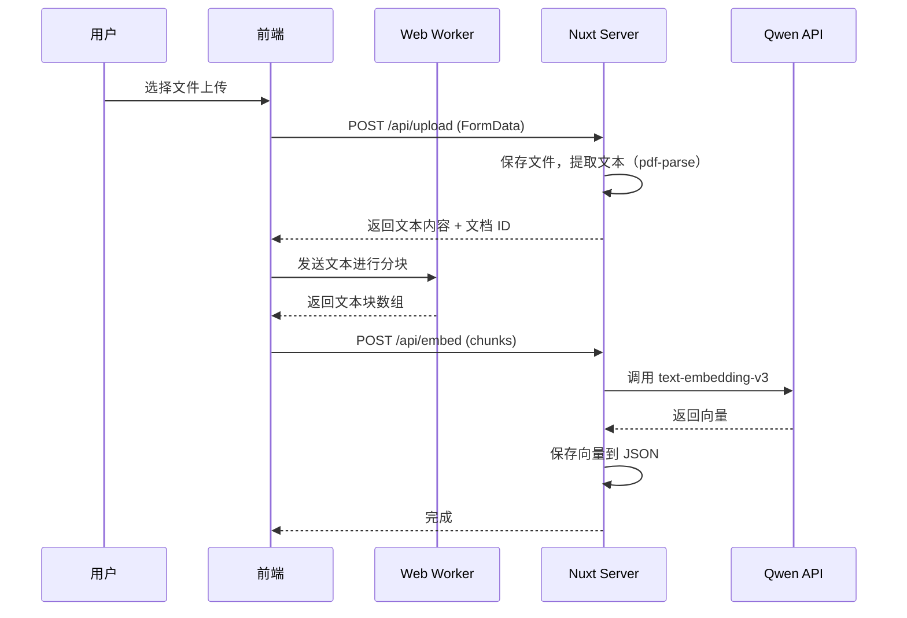
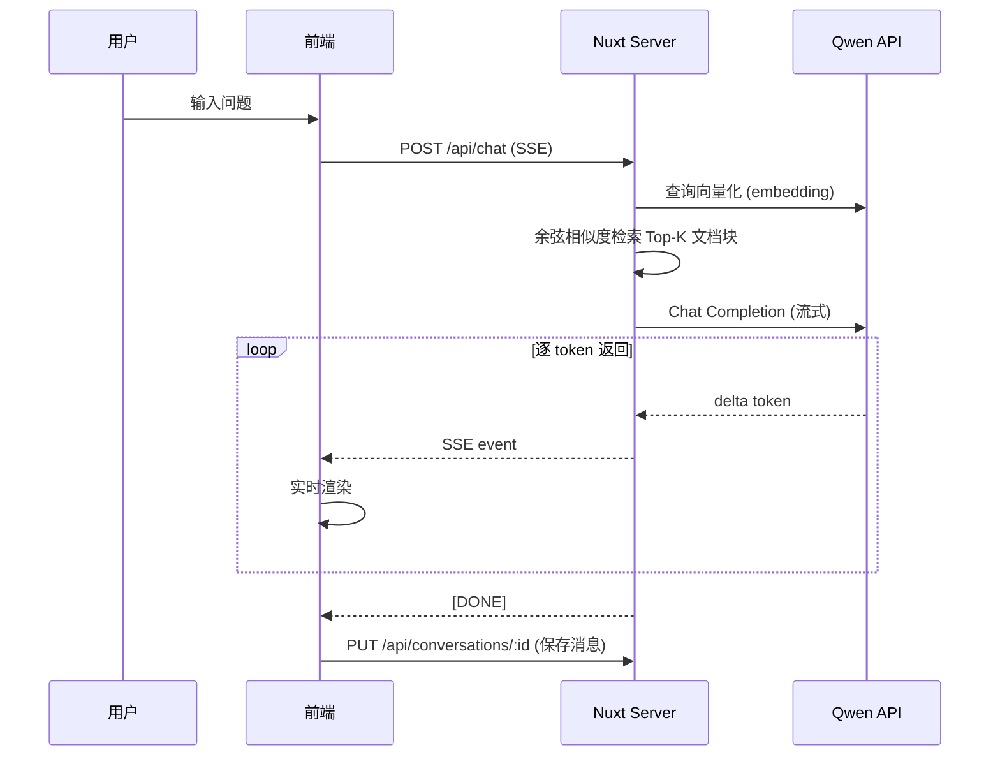

# 本地知识库 RAG Demo 实施方案

  

## 项目概述

  

构建一个基于 Nuxt 3 的全栈 RAG（检索增强生成）知识库应用。用户可上传文档，系统自动提取文本、分块、向量化存储；对话时检索相关上下文，结合 Qwen 大模型生成回答。

  

## 技术选型

  

| 层级 | 技术 | 说明 |

|------|------|------|

| 框架 | Nuxt 3 | Vue 3 + Nitro 全栈，统一前后端 |

| 语言 | JavaScript | 按需求不使用 TypeScript |

| LLM API | Qwen (DashScope) | OpenAI 兼容接口，chat + embedding |

| 向量嵌入 | `text-embedding-v3` | 1024 维，DashScope 提供 |

| 对话模型 | `qwen-plus` / `qwen-max` | 可在配置中切换 |

| 文档解析 | `pdf-parse` | 服务端 PDF 文本提取 |

| 向量存储 | JSON 文件 | Demo 级别，文件持久化 |

| 流式响应 | SSE (h3 createEventStream) | 服务端推送流式回答 |

| 后台处理 | Web Worker | 前端文本分块等重计算 |

| 数据持久化 | 服务端 JSON 文件 | 对话记录、文档索引 |

  

## 核心功能

  

1. **文档上传与处理** — 上传 PDF/TXT/MD，服务端提取文本，Web Worker 分块，API 生成向量

2. **RAG 对话** — 查询时检索相关文档块，注入 prompt，Qwen 流式生成回答

3. **SSE 流式输出** — 逐字流式返回 AI 响应，实时体验

4. **Web Worker** — 文本分块、余弦相似度计算等重任务离线处理

5. **模型配置** — API Key、Base URL、模型名、温度等参数可配

6. **历史对话** — 对话列表侧边栏，支持新建/切换/删除对话

7. **对话持久化** — 所有对话记录保存到服务端文件

8. **页面切换不中断** — SSE 连接在组件卸载时不断开，通过全局状态管理保持流式回答

  

---

  

## 项目结构

  

```

rag/

├── nuxt.config.js

├── package.json

├── app.vue                          # 应用入口

├── pages/

│   ├── index.vue                    # 聊天主页面

│   └── settings.vue                 # 模型配置页面

├── components/

│   ├── ChatSidebar.vue              # 对话历史侧边栏

│   ├── ChatWindow.vue               # 聊天窗口主体

│   ├── ChatInput.vue                # 消息输入框

│   ├── ChatMessage.vue              # 单条消息气泡

│   ├── DocumentUpload.vue           # 文档上传组件

│   └── ModelConfig.vue              # 模型配置表单

├── composables/

│   ├── useChat.js                   # 对话逻辑（发送、SSE、历史）

│   ├── useDocuments.js              # 文档上传与管理

│   └── useSettings.js               # 模型配置管理

├── stores/

│   └── chatStore.js                 # Pinia 全局状态（对话、流式状态）

├── workers/

│   └── textProcessor.worker.js      # Web Worker：文本分块

├── utils/

│   ├── markdown.js                  # Markdown 渲染工具

│   └── textChunker.js               # 文本分块算法（共享）

├── server/

│   ├── api/

│   │   ├── chat.post.js             # SSE 聊天接口

│   │   ├── upload.post.js           # 文档上传接口

│   │   ├── documents.get.js         # 获取文档列表

│   │   ├── documents/

│   │   │   └── [id].delete.js       # 删除文档

│   │   ├── conversations.get.js     # 获取对话列表

│   │   ├── conversations.post.js    # 新建对话

│   │   └── conversations/

│   │       ├── [id].get.js          # 获取单个对话

│   │       ├── [id].put.js          # 更新对话（追加消息）

│   │       └── [id].delete.js       # 删除对话

│   └── utils/

│       ├── storage.js               # JSON 文件读写工具

│       ├── embeddings.js            # 调用 Qwen Embedding API

│       ├── vectorSearch.js          # 余弦相似度检索

│       └── documentParser.js        # PDF/TXT 文本提取

├── public/

│   └── favicon.ico

└── data/                            # 运行时数据目录（gitignored）

    ├── documents/                   # 上传的原始文件

    ├── vectors/                     # 向量索引 JSON

    └── conversations/               # 对话记录 JSON

```

  

---

  

## 详细设计

  

### 1. 文档上传与处理流程

  



  

- **上传接口** (`server/api/upload.post.js`)：使用 `readMultipartFormData` 接收文件，`pdf-parse` 提取 PDF 文本，纯文本文件直接读取

- **Web Worker** (`workers/textProcessor.worker.js`)：接收文本，执行递归字符分块（先按段落、再按句子），返回 chunks 数组

- **向量生成**：服务端批量调用 Qwen `text-embedding-v3` API，将 chunks 转为 1024 维向量

- **存储**：每个文档一个 JSON 文件存储 `{ id, name, chunks: [{ text, vector }] }`

  

### 2. RAG 对话流程

  



  

- **检索**：将用户查询通过 embedding API 向量化，与所有文档向量计算余弦相似度，取 Top-5

- **Prompt 构建**：将检索到的文档块作为 context 注入 system prompt

- **流式输出**：使用 h3 的 `createEventStream`，将 Qwen API 的 stream 响应逐 token 转发到前端

  

### 3. SSE 流式响应（跨页面不中断）

  

> [!IMPORTANT]

> 关键设计：使用 Pinia store 管理全局 SSE 连接状态。EventSource 连接由 store 持有而非组件，组件卸载时不关闭连接。

  

```javascript

// stores/chatStore.js 核心逻辑

// - activeEventSource: 当前 SSE 连接引用

// - streamingMessage: 正在流式生成的消息内容

// - 组件挂载时读取 store 中的流式状态继续渲染

// - 仅在用户主动停止或流完成时关闭连接

```

  

### 4. Web Worker 使用

  

Worker 负责两类重计算任务：

1. **文本分块**：大文档的递归字符分割，避免阻塞 UI

2. **本地向量检索辅助**：（可选）在前端缓存向量时执行相似度计算

  

```javascript

// workers/textProcessor.worker.js

self.onmessage = ({ data }) => {

  const { type, payload } = data

  switch (type) {

    case 'chunk':

      const chunks = recursiveChunk(payload.text, payload.options)

      self.postMessage({ type: 'chunks', payload: chunks })

      break

  }

}

```

  

### 5. 模型配置

  

存储在 `localStorage`（前端）和服务端 `data/config.json`：

  

| 配置项 | 默认值 | 说明 |

|--------|--------|------|

| apiKey | `''` | DashScope API Key |

| baseUrl | `https://dashscope.aliyuncs.com/compatible-mode/v1` | API 基础地址 |

| chatModel | `qwen-plus` | 对话模型 |

| embeddingModel | `text-embedding-v3` | 嵌入模型 |

| temperature | `0.7` | 生成随机性 |

| topK | `5` | 检索文档数 |

| chunkSize | `500` | 分块字符数 |

| chunkOverlap | `50` | 块间重叠字符数 |

  

### 6. 对话历史管理

  

- 侧边栏显示所有对话，按时间排序

- 每个对话存储为 `data/conversations/{id}.json`

- 结构：`{ id, title, messages: [{ role, content, timestamp }], createdAt, updatedAt }`

- 新对话自动使用第一条消息摘要作为标题

  

### 7. UI 设计

  

> [!TIP]

> 采用现代深色主题 + 毛玻璃效果，参考主流 AI 对话产品的 UI 风格。

  

- **布局**：左侧对话历史侧边栏（可折叠）+ 右侧聊天主区域

- **配色**：深色背景 `#0a0a0f` → `#1a1a2e`，紫蓝渐变强调色

- **字体**：Inter (Google Fonts)

- **特效**：消息出现动画、流式文字逐字渲染、按钮 hover 微动画、毛玻璃侧边栏

- **Markdown 渲染**：使用 `marked` 库渲染 AI 回答中的代码块、列表等

  

---

  

## 依赖包

  

```json

{

  "dependencies": {

    "marked": "^14.0.0",

    "pdf-parse": "^1.1.1",

    "@pinia/nuxt": "^0.5.0",

    "pinia": "^2.1.0",

    "uuid": "^9.0.0"

  }

}

```

  

> [!NOTE]

> 不需要额外 HTTP 客户端，Nuxt/Nitro 内置 `$fetch`（基于 ofetch）。向量存储使用 JSON 文件，无需数据库。

  

---

  

## 需要用户确认的事项

  

> [!WARNING]

> 以下配置将直接影响实现方式，请确认：

  

1. **Qwen API 区域**：默认使用中国（北京）端点 `https://dashscope.aliyuncs.com/compatible-mode/v1`，如果你在海外请告知

2. **文件类型支持**：默认支持 PDF、TXT、MD 三种格式，是否需要增加 DOCX 等？

3. **数据持久化**：Demo 使用服务端 JSON 文件存储，是否可接受？（生产环境应换数据库）

4. **Nuxt 版本**：默认使用 Nuxt 3（而非 Nuxt 4），是否确认？

  

---

  

## 验证计划

  

### 功能测试

1. 启动 `npm run dev`，确认无报错

2. 在设置页面配置 API Key，验证保存成功

3. 上传一个 PDF/TXT 文件，确认文本提取 + 分块 + 向量化完成

4. 发送对话消息，确认 SSE 流式返回正常

5. 切换到设置页面再切回，确认流式回答继续

6. 刷新页面，确认历史对话加载正常

7. 新建/切换/删除对话测试

  

### 浏览器测试

- 使用 browser 工具进行交互验证

- 检查 Web Worker 正常工作（DevTools → Sources → Workers）

- 检查 SSE 连接状态（DevTools → Network → EventStream）