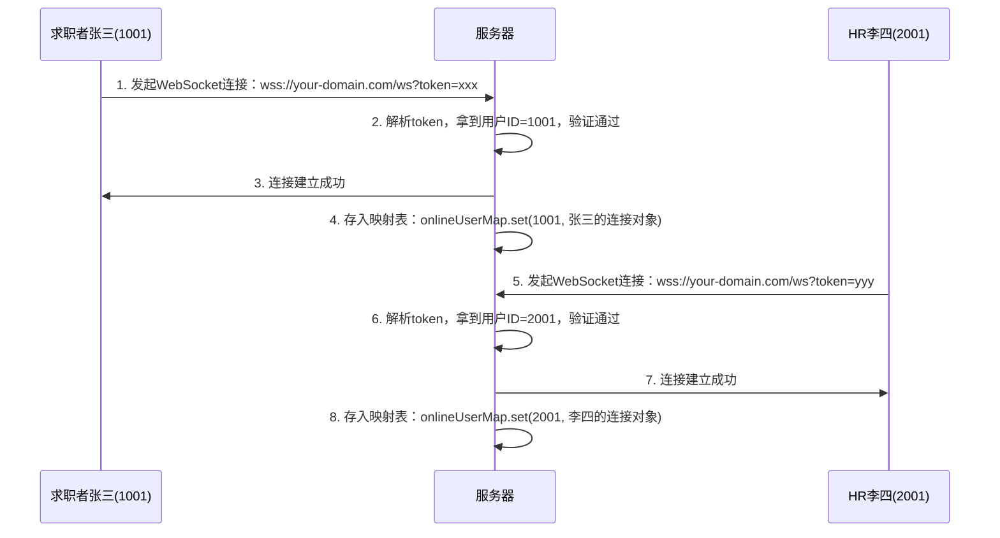

在实时聊天（IM）场景中，WebSocket 是**绝对的主流选择**，因为它需要**双向、低延迟、高频**的通信。这与支付场景的“单向、低频”形成了鲜明对比。

实现一个生产级的 WebSocket 聊天系统，核心难点不在于“连接”，而在于 **“维持连接的稳定性”**（心跳）和 **“应对网络波动”**（断线重连）。

### 一、核心架构设计

#### 1. 通信协议设计

不要直接发送纯文本，建议封装成 **JSON 协议**，区分消息类型：

```json
{
  "type": "CHAT",       // 消息类型：CHAT, HEARTBEAT, ACK, SYSTEM
  "data": {             //  payload
    "content": "你好",
    "timestamp": 1711356000
  },
  "msgId": "uuid-1234"  // 消息唯一ID，用于去重和确认
}
```

#### 2. 心跳机制 (Heartbeat) - 防止“假死”

- **问题**：网络断开时（如拔掉网线、进入电梯），TCP 连接不会立即通知前端，前端以为还连着，发消息却发不出去。
- **原理**：**应用层心跳**。
    - 前端每隔 `N` 秒（如 30s）主动发一个 `PING` 包。
    - 后端收到后，立即回一个 `PONG` 包。
    - **超时判定**：如果前端发出 `PING` 后，`M` 秒（如 10s）内没收到 `PONG`，则判定连接已死，主动断开并触发重连。

#### 3. 断线重连 (Reconnection) - 应对网络波动

- **策略**：**指数退避 (Exponential Backoff)**。
    - 第 1 次失败：等待 1s 重连。
    - 第 2 次失败：等待 2s 重连。
    - 第 3 次失败：等待 4s 重连。
    - ...
    - 最大等待时间：不超过 30s。
- **目的**：避免服务器瞬间被大量重连请求打挂（惊群效应）。
- **上限**：重连次数超过一定阈值（如 10 次）后，停止重连，提示用户“网络异常，请手动刷新”。

> 补充 [WebSocket](../../vue/网络/WebSocket.md) 的网络知识

|状态常量|数值|核心含义|连接阶段|
|:--|:--|:--|:--|
|`WebSocket.CONNECTING`|0|**连接中**|正在与服务器建立握手连接，尚未完成|
|`WebSocket.OPEN`|1|**已连接**|握手成功，连接已建立，可双向收发数据|
|`WebSocket.CLOSING`|2|**关闭中**|正在执行关闭流程，连接即将断开|
|`WebSocket.CLOSED`|3|**已关闭**|连接已彻底关闭，或连接失败 / 握手失败|
### 二、4 个核心事件详解（按生命周期顺序）

下面结合上一节讲的 WebSocket 状态，逐个拆解每个事件的触发时机、作用、用法和注意事项。

#### 1. `onopen`：连接成功事件

##### 核心信息

- **触发时机**：WebSocket 与服务器完成握手、连接正式建立的瞬间
- **对应状态**：触发时，`ws.readyState` 已经从 `CONNECTING(0)` 切换为 `OPEN(1)`
- **核心作用**：连接成功后的初始化操作，是你能安全收发数据的起点
##### 典型用法

```javascript
ws.onopen = () => {
  console.log('WebSocket 连接已建立，当前状态：', ws.readyState); // 输出 1
  // 1. 发送鉴权信息（比如用户token，告诉服务器是谁在连接）
  ws.send(JSON.stringify({ type: 'auth', token: 'xxx' }));
  // 2. 启动心跳保活定时器
  heartBeatTimer = setInterval(() => ws.send('ping'), 30000);
  // 3. 更新UI，提示用户「连接成功」
};
```
##### 关键注意点

只有**握手完全成功**才会触发；如果握手失败（比如跨域、服务器不支持 WebSocket、地址错误），不会触发 `onopen`，会直接触发 `onerror` 和 `onclose`。

#### 2. `onmessage`：接收消息事件

##### 核心信息

- **触发时机**：客户端接收到服务器推送的消息时
- **对应状态**：仅在 `OPEN(1)` 状态下会触发
- **核心作用**：处理服务器下发的所有数据，是业务逻辑的核心入口
##### 典型用法

事件回调的第一个参数是 `MessageEvent` 对象，核心数据在 `event.data` 里：

```javascript
ws.onmessage = (event) => {
  console.log('收到服务器消息：', event.data);
  // 1. 处理JSON格式的业务数据（最常用）
  const res = JSON.parse(event.data);
  switch (res.type) {
    case 'message':
      // 更新聊天消息UI
      renderMessage(res.data);
      break;
    case 'notice':
      // 弹出系统通知
      showNotice(res.data);
      break;
  }

  // 2. 处理二进制数据（比如图片、文件）
  // 需提前设置 ws.binaryType = 'arraybuffer' / 'blob'
};
```
##### 关键注意点

`event.data` 默认是字符串格式（DOMString），如果服务器下发的是 JSON，需要手动 `JSON.parse` 解析；如果是二进制文件，需要提前设置 `ws.binaryType` 指定数据格式。

#### 3. `onerror`：连接错误事件

##### 核心信息

- **触发时机**：连接发生任何异常时（握手失败、网络中断、协议错误、服务器异常断开等）
- **对应状态**：触发后，`ws.readyState` 最终会变为 `CLOSED(3)`
- **核心作用**：捕获异常、上报错误日志、给用户提示错误、触发重连逻辑
##### 典型用法

```javascript
ws.onerror = (error) => {
  console.error('WebSocket 发生错误：', error);
  // 1. 更新UI，提示用户「连接异常」
  showToast('连接失败，请检查网络');
  // 2. 上报错误日志到监控系统
  reportError(error);
};
```
##### 关键注意点

1. `onerror` 触发后，**一定会紧跟着触发 `onclose`**，连接最终会关闭；
2. 出于安全考虑，浏览器不会在错误对象里暴露详细的失败原因（比如跨域错误不会返回具体细节），避免信息泄露。

#### 4. `onclose`：连接关闭事件

##### 核心信息

- **触发时机**：连接彻底关闭时（主动调用 `ws.close()`、服务器主动关闭、网络异常断开、握手失败后）
- **对应状态**：触发时，`ws.readyState` 已经变为 `CLOSED(3)`
- **核心作用**：清理资源、触发重连、更新 UI、记录关闭日志，是连接生命周期的终点
##### 典型用法

事件回调的 `CloseEvent` 对象有 3 个核心属性，用来判断关闭原因：

- `code`：关闭状态码（1000 = 正常关闭，1006 = 异常断连）
- `reason`：关闭的文本原因
- `wasClean`：布尔值，是否是正常的、双方协商后的关闭

```javascript
ws.onclose = (event) => {
  console.log('连接已关闭', event.code, event.reason, event.wasClean);
  // 1. 清理资源：必须清除心跳定时器，否则会造成内存泄漏
  clearInterval(heartBeatTimer);
  // 2. 异常关闭：触发重连逻辑
  if (event.code !== 1000) {
    console.log('连接异常断开，尝试重连...');
    reconnect(); // 自定义的重连函数
  }
  // 3. 更新UI，提示用户连接状态
  updateConnectionStatus('已断开');
};
```
##### 关键注意点

无论连接是正常关闭还是异常断开，都会触发 `onclose`，所以**资源清理、重连逻辑都应该写在 `onclose` 里，而不是 `onerror` 里**。

#### 5. 完整生命周期流程

把事件和状态对应起来，WebSocket 完整的生命周期如下：

1. 执行 `const ws = new WebSocket(...)` → 状态变为 `CONNECTING(0)`，开始和服务器握手
2. 握手成功 → 触发 `onopen` → 状态变为 `OPEN(1)`，可正常收发数据
3. 收到服务器消息 → 触发 `onmessage`，循环执行
4. 发生异常 → 触发 `onerror`
5. 连接彻底关闭 → 触发 `onclose` → 状态变为 `CLOSED(3)`，生命周期结束

### 三、前端实现代码 (Vue 3 + TypeScript/JS)

这是一个封装好的 `useWebSocket` Hook，包含了**心跳、重连、消息队列、状态管理**。

```javascript
// composables/useChatWebSocket.js
import { ref, onUnmounted } from 'vue';

export function useChatWebSocket(url, userId) {
  const socket = ref(null);
  const isConnected = ref(false);
  const messageQueue = ref([]); // 断线期间暂存的消息
  const reconnectAttempts = ref(0);
  const maxReconnectAttempts = 10;
  const reconnectDelay = 1000; // 初始重连间隔 1s
  
  let heartbeatTimer = null;
  let heartbeatTimeoutTimer = null;
  let reconnectTimer = null;

  const HEARTBEAT_INTERVAL = 30000; // 30s 发一次心跳
  const HEARTBEAT_TIMEOUT = 10000;  // 10s 没收到 pong 则判定断开

  // 1. 发送消息（包含心跳和普通消息）
  const send = (data) => {
    if (socket.value && socket.value.readyState === WebSocket.OPEN) {
      socket.value.send(JSON.stringify(data));
      return true;
    } else {
      // 如果未连接，存入队列（可选策略：只存重要消息，或者丢弃心跳）
      if (data.type !== 'HEARTBEAT') {
        messageQueue.value.push(data);
      }
      return false;
    }
  };

  // 2. 发送心跳
  const sendHeartbeat = () => {
    if (!send({ type: 'HEARTBEAT', timestamp: Date.now() })) {
      // 发送失败，说明连接可能已断，触发重连逻辑
      handleClose(true); 
    }
  };

  // 3. 重置心跳计时器
  const resetHeartbeat = () => {
    clearTimeout(heartbeatTimer);
    clearTimeout(heartbeatTimeoutTimer);

    // 启动发送心跳定时器
    heartbeatTimer = setInterval(() => {
      sendHeartbeat();
      // 启动超时监控：如果发了心跳，10s 内没收到 PONG，就断开
      heartbeatTimeoutTimer = setTimeout(() => {
        console.warn('Heartbeat timeout, disconnecting...');
        handleClose(true); 
      }, HEARTBEAT_TIMEOUT);
    }, HEARTBEAT_INTERVAL);
  };

  // 4. 建立连接
  const connect = () => {
    if (socket.value) socket.value.close();

    // 携带 Token 或 UserID 进行鉴权
    const wsUrl = `${url}?token=${localStorage.getItem('token')}&uid=${userId}`;
    socket.value = new WebSocket(wsUrl);

    socket.value.onopen = () => {
      console.log('WebSocket Connected');
      isConnected.value = true;
      reconnectAttempts.value = 0; // 重置重连计数
      resetHeartbeat(); // 启动心跳

      // 发送积压的消息
      while (messageQueue.value.length > 0) {
        const msg = messageQueue.value.shift();
        send(msg);
      }
    };

    socket.value.onmessage = (event) => {
      const data = JSON.parse(event.data);
      
      // 处理心跳响应
      if (data.type === 'PONG') {
        clearTimeout(heartbeatTimeoutTimer); // 收到 PONG，取消超时判定
        return;
      }

      // 处理普通消息
      handleMessage(data);
    };

    socket.value.onerror = (error) => {
      console.error('WebSocket Error:', error);
      // 错误通常紧接着就是 close，不在这里重连，避免重复
    };

    socket.value.onclose = (event) => {
      handleClose(event.code !== 1000); // 非正常关闭才重连
    };
  };

  // 5. 关闭与重连逻辑
  const handleClose = (needReconnect) => {
    isConnected.value = false;
    clearTimeout(heartbeatTimer);
    clearTimeout(heartbeatTimeoutTimer);

    if (socket.value) {
      socket.value.onclose = null; // 防止触发自动重连逻辑
      socket.value.close();
      socket.value = null;
    }

    if (needReconnect && reconnectAttempts.value < maxReconnectAttempts) {
      reconnectAttempts.value++;
      // 指数退避算法：1s, 2s, 4s, 8s... 最大 30s
      const delay = Math.min(reconnectDelay * Math.pow(2, reconnectAttempts.value - 1), 30000);
      
      console.log(`Reconnecting in ${delay}ms (Attempt ${reconnectAttempts.value})`);
      
      reconnectTimer = setTimeout(() => {
        connect();
      }, delay);
    } else if (needReconnect) {
      console.error('Max reconnect attempts reached. Please refresh.');
      // 这里可以触发一个全局事件，通知用户“网络已断开，请刷新”
    }
  };

  // 暴露给组件的方法
  const sendMessage = (content) => {
    send({
      type: 'CHAT',
      data: { content, timestamp: Date.now() },
      msgId: crypto.randomUUID()
    });
  };

  const handleMessage = (data) => {
    // 这里可以将消息推送到 Pinia/Vuex 或者直接 emit 给组件
    console.log('Received Message:', data);
    // 实际项目中通常会调用外部回调：onMessageCallback(data)
  };

  // 初始化连接
  connect();

  // 组件卸载时清理
  onUnmounted(() => {
    clearTimeout(heartbeatTimer);
    clearTimeout(heartbeatTimeoutTimer);
    clearTimeout(reconnectTimer);
    if (socket.value) {
      socket.value.close();
      socket.value = null;
    }
  });

  return {
    isConnected,
    sendMessage,
    messageQueue
  };
}
```



### 四、关键细节解析

#### 1. 心跳的实现逻辑 (Ping-Pong)

- **前端发 Ping**：每 30 秒发一次 `{ type: 'HEARTBEAT' }`。
- **后端回 Pong**：后端收到 `HEARTBEAT` 后，必须立刻回复 `{ type: 'PONG' }`。
- **超时检测**：
    - 前端发出 Ping 的同时，启动一个 `setTimeout` (10秒)。
    - 如果 10 秒内收到了 Pong，`clearTimeout` 取消报警。
    - 如果 10 秒到了还没收到 Pong，说明链路断了（可能是路由器挂了，也可能是服务端进程死了），前端主动调用 `socket.close()` 并触发重连。
    - **为什么需要超时检测？** 因为 TCP 的 keepalive 默认时间太长（通常 2 小时），对于聊天软件来说，用户等不了 2 小时才知道掉线了。

#### 2. 断线重连的“指数退避”

代码中的核心算法：

```javascript
const delay = Math.min(1000 * Math.pow(2, attempts - 1), 30000);
```

- 尝试 1: 1s
- 尝试 2: 2s
- 尝试 3: 4s
- 尝试 4: 8s
- 尝试 5: 16s
- 尝试 6+: 30s (封顶)
- **作用**：如果是机房断电或网络大故障，所有用户同时重连。如果没有退避，服务器会在 1 秒内收到百万级连接请求，直接雪崩。退避让重连流量分散在几十秒内，给服务器喘息机会。

#### 3. 消息队列 (Message Queue)

- **场景**：用户正在打字，突然网断了，用户点击“发送”。
- **处理**：
    - 此时 `socket.readyState` 不是 `OPEN`。
    - 代码将消息推入 `messageQueue` 数组，而不是直接丢弃或报错。
    - 一旦 `onopen` 触发（重连成功），立即遍历队列，把积压的消息发出去。
- **体验**：用户感知不到网络波动，消息最终都能发出去。

#### 4. 鉴权与安全

- **URL 参数鉴权**：`ws://chat.example.com?token=xyz`。简单，但 token 会暴露在 URL 日志中。
- **Sub-protocol 鉴权**：`new WebSocket(url, ['token-xyz'])`。更隐蔽，但后端解析稍麻烦。
- **首包鉴权**：连接建立后，第一帧必须发送 `{ type: 'AUTH', token: '...' }`，后端验证通过后才开始转发消息，否则直接断开。**(推荐)**

### 五、后端配合要点

前端做得再好，后端不配合也没用。后端必须做到：

1. **识别心跳**：收到 `HEARTBEAT` 消息，**不要广播给其他人**，直接单播返回 `PONG`。
2. **服务端超时踢人**：
    - 后端也要做心跳检测！如果后端 60 秒没收到客户端的任何数据（包括心跳），后端应主动关闭连接，释放资源。
    - 防止“僵尸连接”占用内存。
3. **集群消息路由**：
    - 如果用户 A 连在服务器 1，用户 B 连在服务器 2。
    - A 发消息给 B，服务器 1 需要通过 **Redis Pub/Sub** 或 **MQ** 把消息转发给服务器 2，再由服务器 2 推送给 B。
    - WebSocket 本身不具备跨服务器通信能力。
### 六、总结：聊天 vs 支付 的技术选型差异

|特性|实时聊天 (WebSocket)|支付状态 (轮询)|
|---|---|---|
|**连接保持**|**必须长连**，随时可能有消息进来|**无需长连**，只有特定时间点有变化|
|**心跳机制**|**核心**，30s 一次，防假死|不需要，每次 HTTP 请求都是活的|
|**重连策略**|**复杂**，需指数退避、消息队列|**简单**，下次轮询自然重试|
|**服务器压力**|高 (百万并发长连接)|低 (无状态 HTTP)|
|**消息可靠性**|需应用层 ACK 机制 (确保消息必达)|HTTP 状态码即 ACK，天然可靠|
|**实现难度**|⭐⭐⭐⭐ (需处理各种边界情况)|⭐ (几行代码搞定)|
