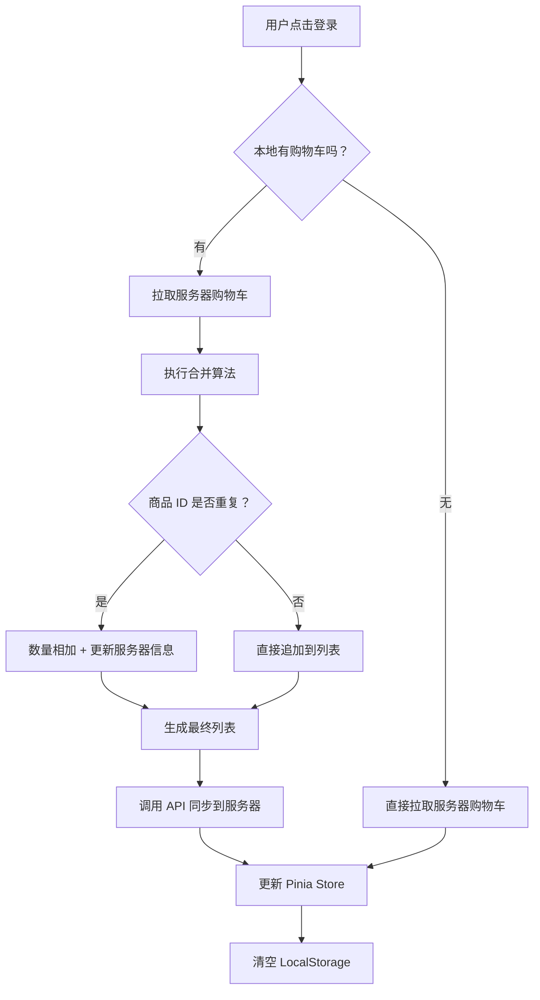

购物车的 **“离线与在线合并机制”**（Cart Merging）是电商系统中提升用户体验最关键、也最易出错的环节之一。

它的核心目标是：**当用户从“游客身份”（离线/本地存储）登录变为“会员身份”（在线/服务器存储）时，自动将两端的购物车数据无缝整合，既不丢失用户刚才选的商品，也不覆盖服务器上已有的历史数据。**
### 1. 为什么要合并？（场景演示）

**❌ 不合并的糟糕体验：**

1. 用户未登录，在手机上加了 **3 件商品** 到购物车（存在 LocalStorage）。
2. 用户点击“登录”，系统从服务器拉取该账号的购物车（可能有 **2 件商品**，是上次在电脑上加的）。
3. **错误做法**：直接用服务器数据覆盖本地数据。
4. **结果**：用户刚选的 3 件商品**消失了**！用户以为出 Bug 了，体验极差。

**✅ 合并后的完美体验：**

1. 用户登录后，系统检测到本地有 3 件，服务器有 2 件。
2. 自动合并：
    - 如果两端有**相同商品**（如都有 iPhone 15）：数量自动相加（1 + 2 = 3）。
    - 如果**不同商品**：全部保留。
3. **结果**：购物车里显示 **5 件商品**（或去重后的逻辑总数），用户感觉非常丝滑。

### 2. 核心合并策略（算法逻辑）

合并通常发生在**用户登录成功后的瞬间**。

#### 步骤一：数据准备

- **LocalCart**：从 `localStorage` 读取的本地购物车数组。
- **ServerCart**：从后端 API 获取的服务器购物车数组。

#### 步骤二：执行合并（以 SKU ID 为唯一键）

遍历 **LocalCart** 中的每一项，尝试与 **ServerCart** 匹配：

|场景|逻辑处理|示例|
|---|---|---|
|**1. 商品仅存在于本地**|直接将该商品**添加**到服务器购物车列表中。|本地有“红色 T 恤”，服务器没有 ➡️ 同步上去。|
|**2. 商品仅存在于服务器**|保留服务器数据（不做操作，本来就在）。|服务器有“蓝色帽子”，本地没有 ➡️ 保留。|
|**3. 商品两端都存在**|**数量相加** (`local.count + server.count`)。  <br>_(可选策略：以服务端价格/库存为准更新其他字段)_|本地有 2 个“手机”，服务器有 3 个 ➡️ 合并为 5 个。|
|**4. 冲突处理**|如果合并后数量超过库存限制，则标记为“缺货”或调整为最大库存。|合并后 100 个，但库存只剩 10 个 ➡️ 设为 10 个并提示。|

#### 步骤三：同步回写

- 将合并后的最终列表调用后端 API **全量更新** 到服务器。
- 更新前端 Pinia Store 的状态。
- **清空** `localStorage` 中的临时购物车（因为数据已上云）。
### 3. Vue 3 + Pinia 代码实现方案

这是一个标准的登录合并流程实现：

```javascript
// src/stores/cart.js
import { defineStore } from 'pinia'
import { ref } from 'vue'
import { apiMergeCart, apiGetCart } from '@/api/cart' // 假设的后端接口

export const useCartStore = defineStore('cart', () => {
  const cartList = ref([])
  
  // ... 其他 getters 和 actions (addCart, removeCart 等)

  /**
   * 【核心】登录时合并购物车
   * 1. 获取本地数据
   * 2. 获取服务器数据
   * 3. 执行合并逻辑
   * 4. 提交给服务器并更新本地状态
   */
  const mergeCartOnLogin = async () => {
    // 1. 获取本地临时购物车 (直接从 localStorage 读，因为 store 可能还没初始化或已被清空)
    const localCartStr = localStorage.getItem('my-shop-cart')
    const localCart = localCartStr ? JSON.parse(localCartStr).cartList : []

    if (localCart.length === 0) {
      // 如果本地没东西，直接拉取服务器数据即可，无需合并
      await fetchServerCart()
      return
    }

    // 2. 获取服务器购物车
    const serverCart = await apiGetCart() // 返回数组

    // 3. 执行合并算法
    // 创建一个 Map 以便快速查找 (key: skuId, value: item)
    const mergedMap = new Map()

    // 先放入服务器数据
    serverCart.forEach(item => {
      mergedMap.set(item.id, { ...item }) // 浅拷贝一份
    })

    // 再遍历本地数据进行合并
    localCart.forEach(localItem => {
      if (mergedMap.has(localItem.id)) {
        // 情况 3: 商品都存在 -> 数量相加
        const serverItem = mergedMap.get(localItem.id)
        serverItem.count += localItem.count
        
        // 可选：以服务器最新价格为准，防止本地价格被篡改
        // serverItem.price = localItem.price // 或者坚持用服务器的
      } else {
        // 情况 1: 仅本地存在 -> 直接加入
        mergedMap.set(localItem.id, { ...localItem })
      }
    })

    // 转换 Map 回数组
    const finalCartList = Array.from(mergedMap.values())

    // 4. 将合并后的数据提交给服务器
    try {
      await apiMergeCart(finalCartList) 
      
      // 5. 更新前端 Store 状态
      cartList.value = finalCartList
      
      // 6. 清理本地临时数据 (因为已经同步到云端了)
      localStorage.removeItem('my-shop-cart')
      
      console.log('购物车合并成功！')
    } catch (error) {
      console.error('合并失败，降级处理：保留本地数据', error)
      // 失败降级策略：至少保证用户看到本地的数据，不报错白屏
      cartList.value = localCart
    }
  }

  const fetchServerCart = async () => {
    const data = await apiGetCart()
    cartList.value = data
  }

  return {
    cartList,
    mergeCartOnLogin,
    fetchServerCart,
    // ...
  }
}, {
  persist: { key: 'my-shop-cart', storage: localStorage }
})
```

#### 在登录动作中调用

```javascript
// src/views/Login.vue
<script setup>
import { useUserStore } from '@/stores/user'
import { useCartStore } from '@/stores/cart'

const userStore = useUserStore()
const cartStore = useCartStore()

const handleLogin = async (credentials) => {
  // 1. 执行登录，获取 Token
  await userStore.login(credentials)
  
  // 2. 登录成功后，立即触发购物车合并
  if (userStore.isLoggedIn) {
    await cartStore.mergeCartOnLogin()
  }
}
</script>
```
### 4. 关键细节与边缘情况处理

#### Q1: 如果合并后数量超过库存怎么办？

- **策略**：在合并逻辑中加入库存校验。
- **代码逻辑**：
    
```javascript
    const newCount = serverItem.count + localItem.count
    if (newCount > serverItem.stock) {
       serverItem.count = serverItem.stock // 设为最大库存
       serverItem.overStock = true // 标记一个字段，前端显示“仅剩 X 件”
    } else {
       serverItem.count = newCount
    }
```
#### Q2: 价格以哪个为准？

- **原则**：**永远以服务器价格为准**。
- **原因**：本地 `localStorage` 的价格可能被用户通过开发者工具篡改。合并时，即使保留了本地的 `count`，也要强制使用服务器返回的 `price`、`title`、`image` 等最新信息。

#### Q3: 如果用户登录失败怎么办？

- **策略**：什么都不做。保持 `localStorage` 中的离线数据不变，用户继续以游客身份购物。下次登录再试。

#### Q4: 多端登录冲突（手机和电脑同时操作）？

- 这是后端需要解决的问题。通常采用 **“最后写入胜利” (Last Write Wins)** 或 **乐观锁** 机制。
- 前端只需负责：每次进入购物车页面或操作前，尽量拉取最新服务器数据校对一次。

### 5. 总结流程图



### 最佳实践 Checklist

1. [x] **触发时机**：仅在 `login` 成功回调中触发。
2. [x] **唯一键**：确保使用 `skuId` 而非 `spuId` 作为合并依据。
3. [x] **数据清洗**：合并时使用服务器的最新价格、标题、图片，只采纳本地的 `count` 和 `selected` 状态。
4. [x] **异常处理**：API 请求失败时，不要清空本地数据，给予用户提示或降级展示。
5. [x] **清理现场**：合并成功后，务必删除 `localStorage` 中的旧数据，防止下次登录重复合并。